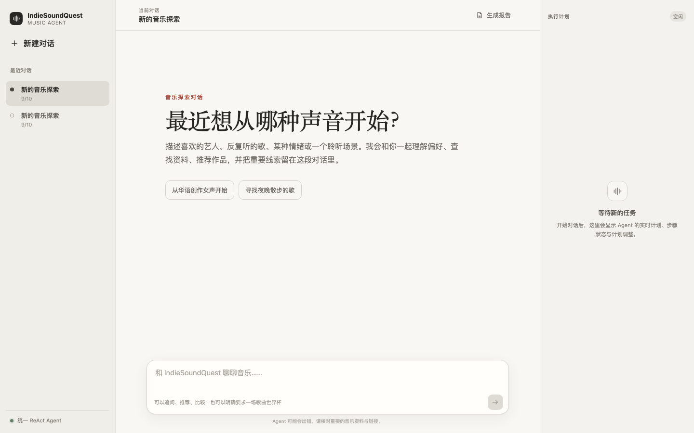
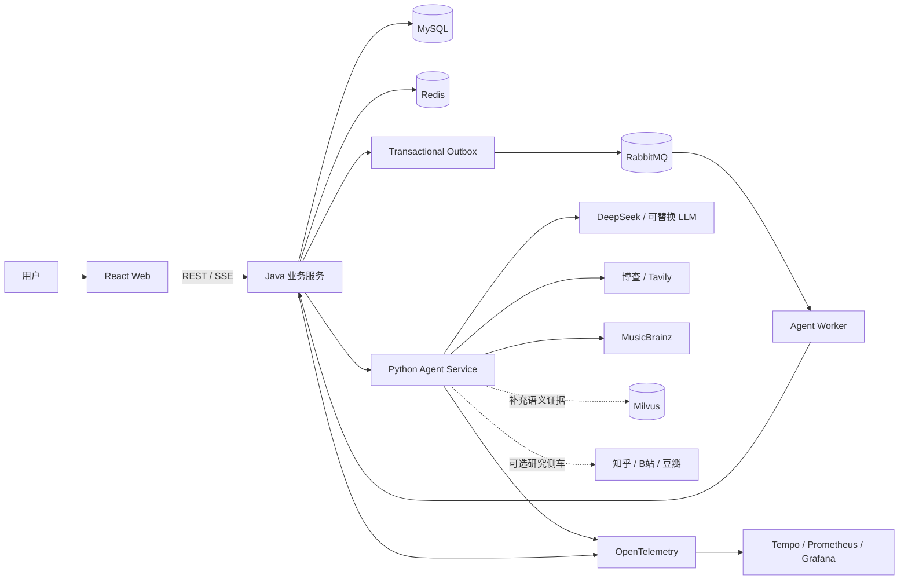

# IndieSoundQuest

> 一个以多轮对话为主入口、由统一 ReAct Agent 驱动的中文音乐探索应用。

IndieSoundQuest 不要求用户先填写标签或进入固定流程。用户可以直接描述喜欢的艺人、歌曲、声音、场景或情绪，Agent 会结合多轮上下文，在公开网络中寻找线索、通过 MusicBrainz 核验歌曲身份，并返回可继续追问和反馈的歌曲/艺人卡片。

“歌曲世界杯”仍然存在，但它是一项按需进入的 Skill：只有用户明确要求淘汰赛、两两对决或直接开赛时，系统才会构建 16/32 首候选池。比赛结束后，完整选择轨迹可用于生成赛后偏好报告。

[在线体验](https://indiesoundquest.cn/)

## 界面预览

前端采用三栏 Agent 工作台：左侧管理持久化会话，中间承载对话、工具摘要与结果卡片，右侧展示会随 ReAct 决策滚动调整的计划。模型运行时只公开可展示的步骤与耗时，不暴露思维链。



## 为什么做这个项目

多数音乐推荐产品依赖平台内部行为数据，普通用户很难知道“为什么推荐给我”，也很难用自然语言连续修正方向。本项目尝试把音乐探索变成一个可解释、可追问、可操作的 Agent 过程：

- 支持“更冷一点”“换一批”“不要这些艺人”“保留上一轮那首”等上下文相关追问；
- 公开网络负责发现新内容，本地曲库不会限制用户的兴趣范围；
- MusicBrainz 负责身份核验，避免把搜索结果中的同名歌曲和艺人直接写入业务库；
- 推荐、报告、候选池和赛事结果都以持久化卡片存在，而不是一次性文本；
- 前端只展示可公开的计划、工具摘要和结果，不展示模型思维链、密钥或内部地址。

## 当前能力

### 对话式音乐探索

- 访客会话与消息持久化；
- 统一音乐探索 Agent，每轮对话由 ReAct Supervisor 自主选择工具；
- 同时装配近期文本、会话摘要、长期偏好、推荐反馈和历史卡片；
- 普通问答、公开资料研究、歌曲/艺人推荐与探索报告；
- 推荐卡默认展示 5–7 首已核验歌曲与 2–3 位艺人，并保留来源、封面、试听或平台搜索入口；
- 对上一轮推荐进行“更冷、更偏现场、换一批、排除某艺人”等增量修正；
- 点赞、跳过、收藏等反馈沉淀为偏好事件，供后续对话使用。

### 可选歌曲世界杯 Skill

- 16/32 首单败淘汰赛；
- Agent 生成两倍候选：16 首赛事准备 32 首、32 首赛事准备 64 首，未展示部分作为补位池；
- 支持单艺人世界杯、跨艺人探索和完全手动选择；
- 具名艺人存在身份歧义时先阻塞生成并请求确认；
- 在线发现、MusicBrainz 核验、Java 规范化落库、候选确认后开赛；
- 投票事务、乐观锁、唯一约束与幂等保护；
- 完整对阵、冠军结果、选择轨迹、赛后报告与长图导出。

### Agent 运行与工程化

- Agent Run 控制面、RabbitMQ Worker、Transactional Outbox；
- 可恢复 SSE 事件流，展示滚动计划、工具调用摘要、降级和结果；
- Redis 幂等缓存、限流、热点状态与短期互斥；
- Agent 任务租约、心跳、失败重试和中断恢复；
- Java 对 Agent 输出执行最终 Schema 校验和事务落库；
- Resilience4j 超时、重试、限流、熔断与 Provider 级降级；
- OpenTelemetry、Prometheus、Tempo、Grafana 可观测性链路。

## 系统架构



职责边界：

| 组件 | 主要职责 |
| --- | --- |
| React Web | 多轮对话、持久化卡片、候选确认、比赛、报告及长图展示 |
| Java Service | REST API、会话与赛事领域模型、事务一致性、幂等、Agent Run 控制面、最终落库 |
| Python Agent Service | LangGraph ReAct 决策、工具选择、候选池/报告等复合 Tool、结构化输出 |
| Agent Worker | 消费异步任务、维护租约和心跳、回传事件及最终结果 |
| MySQL / Redis / RabbitMQ | 持久化、缓存与互斥、异步消息 |
| Milvus | 已审核主题卡的语义检索增强；仅为 bonus，不是歌曲发现主链路 |

## Agent 设计

对外只存在一个统一音乐探索 Agent。内部能力分为两层：

- 原子 Tool：网络搜索、知识库检索、MusicBrainz 核验、偏好反馈记录；
- 复合 Tool：普通音乐推荐、候选池构建、赛事分析、探索报告和赛后报告。

歌曲世界杯被注册为 Skill，而不是默认路由。ReAct Supervisor 根据用户显式意图、当前观察、工具预算和会话上下文决定下一步；护栏只负责安全、预算、契约校验和无收益循环阻断，不把 Agent 退化成固定工作流。

候选发现遵循以下数据边界：

```text
公开网络发现 → MusicBrainz 身份核验 → Java 规范化与去重 → 推荐卡 / 候选池 / 赛事
                              ↑
                Milvus 仅补充主题和文化语境
```

## 数据与外部服务

| 来源 | 定位 | 是否为主链路 |
| --- | --- | --- |
| 博查 Web Search | 中文查询和在线音乐线索发现 | 是，中文查询优先 |
| Tavily | 通用网络搜索与降级来源 | 是，按查询与可用性选择 |
| MusicBrainz | 艺人、作品、录音的规范身份核验 | 是 |
| Cover Art Archive | MusicBrainz 关联封面 | 是 |
| Apple iTunes Search | 可用时补充试听与播放信息 | 否 |
| 网易云音乐 | 显式平台搜索跳转，不调用非公开 API | 否 |
| 知乎 / B站 / 豆瓣 | 受控研究侧车，补充创作背景与文化语境 | 可选 |
| Milvus 主题卡 | 本地已审核知识的语义补充 | 可选 bonus |

任何 API Key 只由服务端环境变量管理，不进入仓库、日志、SSE 或模型上下文。项目不保存和分发完整受版权保护的音频。

## 技术栈

| 层 | 技术 |
| --- | --- |
| 前端 | React 18、TypeScript、Vite、Vitest、html-to-image |
| Java 后端 | Java 21、Spring Boot 3.4、Spring Data JPA、Spring Web、Springdoc OpenAPI |
| Agent | Python 3.12、FastAPI、LangGraph、LangChain、Pydantic |
| 数据 | MySQL 8.4、Flyway、Redis 7.4、Milvus 2.4 |
| 异步 | RabbitMQ、Transactional Outbox、Worker Lease |
| 韧性与观测 | Resilience4j、Micrometer、OpenTelemetry、Prometheus、Tempo、Grafana |
| 交付 | Docker Compose、Caddy（生产配置） |

## 目录结构

```text
IndieSoundQuest/
├── web/                  # React 对话、卡片、赛事与报告界面
├── java-service/         # Java 领域服务、API、迁移和异步控制面
├── agent-service/        # 统一 ReAct Agent、工具、复合能力与 Worker
├── zhihu-research/       # 可选知乎开放平台研究侧车
├── bilibili-research/    # 可选 B 站公开内容研究侧车
├── douban-research/      # 可选豆瓣公开内容研究侧车
├── infra/                # 本地/生产 Compose 与可观测性配置
├── Demos/                # 数据处理、模块验证和端到端验收脚本
└── Specs/                # 产品、数据、架构和功能规格
```

## 本地启动

### 前置条件

- Docker Desktop（建议给 Docker 分配至少 8 GB 内存）；
- Docker Compose v2；
- 一个 DeepSeek API Key；
- 至少配置博查或 Tavily 中的一个搜索 Key，才能获得完整的在线推荐体验。

首次构建会下载 Java、Node、Python、Milvus 和可观测性相关镜像/依赖；网络不稳定时请参考 [Docker 本地排障手册](./Specs/00-总览与规范/12-Docker本地排障手册.md)。

### 1. 配置环境变量

```bash
cp .env.example .env
```

编辑 `.env`，至少填写：

| 变量 | 用途 |
| --- | --- |
| `DEEPSEEK_API_KEY` | 默认大模型 |
| `BOCHA_API_KEY` | 中文在线搜索，推荐配置 |
| `TAVILY_API_KEY` | 通用搜索与降级，可选 |
| `AGENT_INTERNAL_SERVICE_TOKEN` | Java 与 Agent 内部接口鉴权，请替换示例值 |
| `MYSQL_*` | 本地数据库与用户密码 |
| `RABBITMQ_DEFAULT_*` | 异步任务队列凭证 |

不要将 `.env` 提交到 Git。

### 2. 启动主链路

```bash
docker compose --env-file .env -f infra/compose.yaml up -d --build \
  web agent-service agent-worker
```

Compose 会自动启动这些服务依赖的 Java、MySQL、Redis、RabbitMQ、Milvus、etcd 和 MinIO。

### 3. 检查服务

```bash
docker compose --env-file .env -f infra/compose.yaml ps
curl http://localhost:8080/actuator/health
```

本地入口：

- Web：<http://localhost:5173>
- Java 健康检查：<http://localhost:8080/actuator/health>
- Swagger UI：<http://localhost:8080/swagger-ui/index.html>
- Grafana（启动可观测性组件后）：<http://localhost:3000>

Agent 服务只在 Compose 网络内开放，可通过下面的命令检查：

```bash
docker compose --env-file .env -f infra/compose.yaml exec agent-service \
  curl -fsS http://localhost:8000/health/ready
```

### 4. 可选：启用国内内容研究侧车

先在 `.env` 中开启对应的 `*_RESEARCH_ENABLED` 配置；知乎还需要 `ZHIHU_ACCESS_SECRET`。然后执行：

```bash
docker compose --env-file .env -f infra/compose.yaml \
  --profile domestic-research up -d --build \
  zhihu-research bilibili-research douban-research
```

这些侧车不会对宿主机开放端口，也不是完成普通推荐所必需的依赖。

### 5. 停止服务

```bash
docker compose --env-file .env -f infra/compose.yaml down
```

默认不会删除数据卷。只有明确需要清空本地数据时，才额外使用 `down -v`。

## 测试与验收

### 单元测试和构建

```bash
# Java
mvn -q test -f java-service/pom.xml

# Python Agent（通过 Docker test stage）
docker build --target test -t indie-sound-quest-agent-test agent-service
docker run --rm indie-sound-quest-agent-test

# Web
npm --prefix web test
npm --prefix web run build
```

### 已启动环境的接口验收

```bash
# 完整用户流程
python3 Demos/verify_full_user_flow.py

# 赛事领域 API
python3 Demos/verify_tournament_api.py

# 外部音乐 Provider
python3 Demos/verify_music_providers.py
```

外部 Provider 验收会受到网络、配额和第三方服务状态影响；失败时先区分业务回归与外部依赖降级。

## 规格文档

完整导航见 [Specs/README.md](./Specs/README.md)。建议从以下文档开始：

1. [系统总体设计与规格路线图](./Specs/00-总览与规范/00-系统总体设计与规格路线图.md)
2. [MVP 产品规格](./Specs/01-产品/03-MVP产品规格：歌曲世界杯与音乐探索.md)
3. [对话式会话运行时](./Specs/03-技术架构/11-对话式会话运行时技术规格.md)
4. [音乐探索 Agent 自主决策架构](./Specs/03-技术架构/12-音乐探索Agent运行时与自主决策架构.md)
5. [异步 Agent Run、Worker 与可恢复事件流](./Specs/03-技术架构/16-异步AgentRun、Worker与可恢复事件流规格.md)
6. [歌曲世界杯核心闭环](./Specs/04-功能规格/歌曲世界杯/01-歌曲世界杯核心闭环.md)

## 当前阶段与边界

这是一个持续迭代的求职作品项目，目前已经跑通对话、推荐、候选池、比赛、报告、异步任务与基础可观测性主链路。当前版本仍保留这些边界：

- 使用访客会话，不包含复杂账号与权限系统；
- 不提供用户社交、评论或公开内容发布；
- 不调用网易云、QQ 音乐等平台的非公开接口；
- 国内内容研究属于增强能力，任一侧车不可用时不应阻塞主流程；
- Milvus 只增强解释质量，不负责决定可推荐的歌曲集合。

如果你准备阅读代码，建议按 `ConversationController → AgentRunApplicationService → ConversationReActRuntime → ToolRegistry/SkillRegistry` 的顺序进入主链路。
