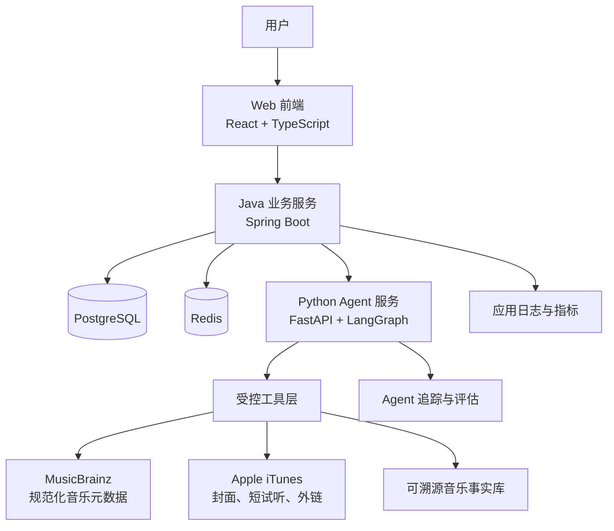

# 音乐探索 Agent：系统总体设计与规格路线图

**状态：** 草案 v0.1  
**最后更新：** 2026-07-31  
**本文作用：** 定义项目的系统边界、模块职责、规格拆分方式与开发顺序。具体实现细节以各子规格为准。

## 1. 项目定位

这是一个面向中文音乐用户的个人音乐探索 Agent。

它不试图成为音乐播放器、歌词站或社交社区；它的目标是帮助用户以较低门槛理解陌生艺人、专辑和音乐场景，并形成一条可执行、可解释、可根据反馈调整的聆听路线。

当前工作方向是“歌曲世界杯 + 音乐探索 Agent”：用户可直接为喜欢的艺人举办歌曲世界杯，也可让 Agent 以世界杯形式收集其选择信号；系统据此生成可解释的音乐偏好报告，并推荐下一批值得探索的歌曲、艺人或入坑路线。

## 2. 系统目标与边界

### 2.1 目标

1. 为用户生成有顺序、有理由、可调整的音乐探索路线。
2. 让每一条关键音乐事实具有来源，避免 Agent 编造创作背景。
3. 支持中文艺人和歌曲的准确实体识别及跨平台资源映射。
4. 用 Java 承担稳定、可审计的业务域；用 Python + LangGraph 承担 Agent 推理与工作流。
5. 以个人使用为核心，保护用户偏好和探索历史。

### 2.2 首版不做

- 完整歌曲播放、下载或音频托管；
- 完整歌词展示、歌词爬取或歌词 RAG；
- 评论、动态、公开榜单、好友关系等社交能力；
- 从听歌偏好推断教育背景、心理状态或真实人格；
- 未授权的国内音乐平台接口与内容抓取；
- 一开始引入不必要的微服务、消息队列或独立向量数据库。

## 3. 总体架构



### 3.1 已确定的技术基线

| 层级 | 选型 | 决策理由 |
| --- | --- | --- |
| Web 前端 | React + TypeScript + Vite | React 生态成熟，适合构建赛事交互、可视化结果与流式 Agent 页面 |
| 业务服务 | Java 21 + Spring Boot 3（后续服务规格确认细节） | 承担赛事、投票、偏好数据、权限等稳定业务域 |
| Agent 服务 | Python 3.12 + FastAPI + LangGraph | 支持有状态工作流、受控工具调用、重规划与流式生成 |
| 默认模型 | DeepSeek | 当前已有可用 API 与使用经验 |
| 模型抽象 | 多供应商 Provider Interface | 模型调用不绑定 DeepSeek；后续可接入通义千问、OpenAI 兼容服务等 |
| 业务数据库 | MySQL 8 | 满足事务型 CRUD、赛事快照和用户数据需求，且符合当前开发经验 |
| 缓存/短状态 | Redis（后续服务规格确认） | 用于会话、限流、临时 Agent 状态和热点缓存 |
| 向量检索 | Milvus | 承载音乐资料与可溯源知识片段的语义检索，不与 MySQL 职责重叠 |
| 图关系 | Neo4j（后续增强） | 知识图谱成熟后再接入，不阻塞 MVP |
| 本地部署 | Docker Compose | 保证一键启动多服务本地开发环境 |
| Agent 可观测性 | Langfuse / OpenTelemetry（后续确认） | 追踪模型调用、工具调用、路线生成质量与成本 |

**MySQL 与 PostgreSQL 的取舍。** 两者都足以承担本项目的账户、赛事、投票、偏好报告等事务型数据。PostgreSQL 的突出优势是 `JSONB`、复杂查询和 `pgvector`；但本项目已选择 Milvus 作为独立向量数据库，`pgvector` 的优势不再是决定性因素。因此 MVP 采用 MySQL 8，以开发效率和项目可维护性优先。若未来取消 Milvus、希望将向量检索合并到业务数据库，再重新评估 PostgreSQL。

## 4. 模块职责

| 模块 | 主要职责 | 不负责的事 |
| --- | --- | --- |
| Web 前端 | 世界杯赛程、试听入口、投票/反馈、偏好报告、探索路线、历史查看 | 直接访问第三方音乐 API、保存业务规则 |
| Java 业务服务 | 账号、权限、赛事/赛程/投票、偏好快照、路线进度、收藏、来源管理、对外业务 API | LLM 编排、直接生成音乐结论 |
| Python Agent 服务 | 候选歌曲策展、资料调研、偏好分析、推荐与路线规划、引用组织 | 直接管理用户权限、直接写入核心业务表 |
| 音乐数据 Provider | 查询和对齐 MusicBrainz/Apple 等外部资源，返回统一 DTO | 向模型提供未授权歌词或音频内容 |
| 可溯源事实库 | 保存经审核的音乐背景事实、来源和适用实体 | 存储整篇受版权保护的文章 |
| 可观测与评估 | 路线质量、引用覆盖、耗时、失败率、模型成本 | 收集无必要的个人敏感信息 |

## 5. 核心业务闭环（待子规格细化）

```text
选择艺人或探索目标
  → 创建歌曲世界杯（经典模式或探索模式）
  → 用户试听并在赛程中做出选择
  → 保存赛事结果与可解释的偏好信号
  → Agent 分析本次及历史选择
  → 生成歌曲/艺人推荐、入坑路线与音乐偏好报告
  → 用户继续探索或单独体验下一场世界杯
```

首版建议只支持“基于单位艺人的歌曲世界杯”。专辑导赏、流派入门、音乐节预习和跨艺人主题探索均作为后续扩展，不与 MVP 并行开发。

### 5.1 两种世界杯模式

| 模式 | 用户目标 | Agent 参与方式 | 是否可独立使用 |
| --- | --- | --- | --- |
| 经典世界杯 | 为一位艺人选出自己的本命歌 | 不干预赛程；赛事结束后可选生成总结 | 是 |
| 探索世界杯 | 用几轮有趣选择找到自己的音乐偏好与下一步方向 | 选择覆盖不同时期/风格的候选池，解释结果并生成推荐 | 是 |

两种模式均保持私有，不设公开排行、对战或社交传播。赛事的“冠军”只代表当前用户在当前赛事中的选择，绝不表示歌曲的客观优劣。

## 6. 关键设计原则

### 6.1 事实与推荐理由分离

Agent 输出必须区分：

- **已验证事实**：具有来源 URL、来源类型和置信/审核状态；
- **个性化建议**：由用户本次反馈、偏好及已验证事实推导而来。

### 6.2 实体先于内容

所有歌曲、艺人、专辑先解析为内部规范实体，再附加 Apple、酷狗等供应商资源。Agent 不根据歌名文本猜测歌曲版本。

### 6.3 可控 Agent

Agent 只能通过工具层访问音乐数据和业务能力；每项工具定义输入、输出、来源、权限和失败降级方式。用户的确认或反馈是路线状态变化的唯一依据。

### 6.4 先单体边界，后服务演进

代码仓库可以多目录组织，但 MVP 只保留 Java 业务服务与 Python Agent 服务两项后端部署单元。Java 与 Python 采用 HTTP/SSE 通信；批量资料处理确有需要时再评估任务队列。

### 6.5 隐私默认保护

用户偏好、探索记录默认私有；提供查看与删除能力；不建设社交图谱，不做敏感个人属性推断。

## 7. 规格层级与交付物

| 顺序 | 规格 | 目的 | 当前状态 |
| ---: | --- | --- | --- |
| 00 | 系统总体设计与规格路线图 | 系统边界、模块、依赖与拆分原则 | 当前文档 |
| 01 | 歌曲信息数据来源与版权边界 | 数据源、授权和内容使用限制 | 已完成 |
| 02 | 外部音乐数据接口验证 | 验证 MusicBrainz、Apple 与封面回退能力 | 已完成 |
| 03 | MVP 产品规格：歌曲世界杯与音乐探索 | 用户故事、赛制、页面、输入输出、验收标准 | 待编写 |
| 04 | 音乐实体模型与跨平台匹配 | 实体模型、Provider Mapping、版本消歧与缓存 | 待编写 |
| 05 | Agent 工作流规格 | LangGraph 状态、节点、工具、路由、失败处理 | 待编写 |
| 06 | Java 业务服务规格 | 领域模型、权限、路线/进度 API、数据一致性 | 待编写 |
| 07 | Python Agent 服务规格 | FastAPI API、工具接口、SSE、模型输出契约 | 待编写 |
| 08 | Web 前端规格 | 信息架构、页面、交互状态与可访问性 | 待编写 |
| 09 | Milvus 知识库与事实治理 | 来源登记、知识 Claim、嵌入、检索、审核与版权边界 | 已完成 |
| 10 | 质量、评估与可观测性 | 测试集、指标、日志、追踪与成本控制 | 已完成 |
| 11 | 本地开发与部署规格 | 环境变量、Docker Compose、CI、运行手册 | 已完成 |

## 8. 规格编写和开发规则

1. 子规格不得突破本文的系统边界；若需要调整边界，先更新本文并记录原因。
2. 每一份子规格至少包含：目标、非目标、输入输出、数据归属、异常/降级策略、验收标准。
3. 每个模块在实现前必须有对应规格；每个规格完成后都要列出可执行验证方式。
4. 外部接口、模型输出和跨服务调用必须定义稳定的数据契约，不允许前端或 Agent 直接依赖供应商原始响应。
5. 先完成纵向 MVP 闭环，再扩展音乐对象、数据供应商或复杂玩法。

## 9. 当前待决策事项

以下问题需要在后续规格中明确，而不是在当前阶段假定：

1. 首版赛事规模、赛制、复活赛规则和弃选/平票处理；
2. 用户不登录时是否可体验、何时要求登录保存进度；
3. 首版模型供应商、模型降级策略和预算；
4. 偏好报告的维度、最小证据量与不作推断的边界；
5. 背景事实库采用纯人工录入、半自动提取还是二者结合；
6. 是否在 MVP 接入 Apple 短试听，还是先只提供外链；
7. 前端采用 React 还是 Vue；
8. Java 服务与 Agent 服务的鉴权方式、幂等与流式协议细节。

## 10. 下一步

优先编写 `03-MVP产品规格：歌曲世界杯与音乐探索.md`。该文档将锁定首版赛制、用户任务、Agent 介入点和验收标准，随后才能准确设计实体模型、Agent 工作流和前后端 API。
