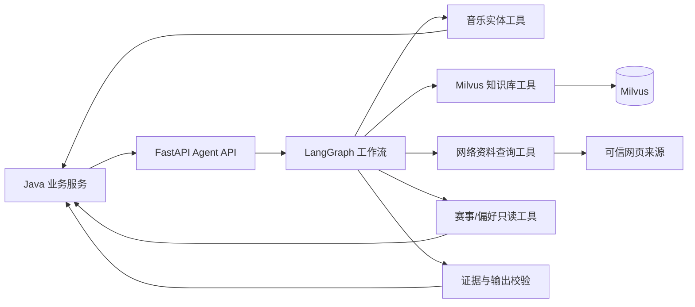

# Agent 工作流规格

**状态：** 草案 v0.1  
**最后更新：** 2026-08-01  
**上级规格：** `00-系统总体设计与规格路线图.md`  
**依赖规格：** `03-MVP产品规格：歌曲世界杯与音乐探索.md`、`04-音乐实体模型与跨平台匹配.md`

## 1. 目标与边界

Agent 服务负责把受控音乐数据、可追溯资料和用户赛事选择转化为：

1. 探索世界杯的候选池及其策展说明；
2. 单场赛事的偏好总结和下一步推荐；
3. 多场赛事的整体音乐偏好报告。

Agent 不负责账号、权限、赛程生成、投票落库、赛事状态迁移或外部资源映射。这些均由 Java 业务服务负责。

## 2. 总体设计



## 3. Agent 工作流清单

| 工作流 | 触发时机 | 输入 | 输出  | 是否改变业务数据 |
| --- | --- | --- | --- | --- |
| `exploration_tournament_planner` | 用户创建探索世界杯 | 艺人、赛事规模、用户目标、候选限制 | 候选池草稿、策展说明、证据    | 否 |
| `tournament_insight_generator` | 用户完成赛事 | 已完成赛事快照、用户投票、已有偏好摘要 | 本场总结、3–5 条推荐 | 否 |
| `taste_profile_generator` | 用户查看整体报告且达到门槛 | 多场有效赛事、历史偏好快照 | 整体偏好报告、下一步探索主题 | 否 |

Java 服务负责保存 Agent 返回的版本化结果；Agent 只能返回建议，不能直接写入 MySQL。

## 4. 通用 Agent 状态

所有 LangGraph 状态都必须可序列化、可追踪，并禁止保存完整歌词、音频二进制或受限 Provider 原始内容。

```python
class AgentState(TypedDict):
    request_id: str
    workflow: str
    user_id: str | None
    locale: str
    input: dict
    resolved_entities: list[dict]
    candidate_recordings: list[dict]
    user_signals: list[dict]
    verified_claims: list[dict]
    web_sources: list[dict]
    evidence: list[dict]
    draft_output: dict | None
    validation_errors: list[dict]
    warnings: list[str]
    trace_id: str
```

状态设计要求：

- `request_id` 由 Java 生成，用于幂等和审计；
- 每个节点只追加或替换自己拥有的状态字段；
- `evidence` 必须可追溯到实体 ID、知识库 Claim ID 或 URL；
- 不向前端暴露模型内部推理链，仅暴露结构化阶段事件和用户可读摘要；
- 状态持久化策略由实现决定，但可恢复状态只能保留必要业务上下文与来源引用。

## 5. 受控工具契约

### 5.1 音乐实体工具

数据来自 Java 的实体/Provider 层，Agent 不直接访问 MusicBrainz、Apple 或未来商业 Provider。

| 工具 | 输入 | 输出 | 限制 |
| --- | --- | --- | --- |
| `resolve_artist` | `query`、`locale` | 已消歧艺人候选 | 只能返回内部 UUID、MBID、名称、置信度 |
| `list_artist_recordings` | `artist_id`、`limit`、筛选条件 | 可用 Recording 列表 | 只返回符合版本规则的规范实体 |
| `get_recording_context` | `recording_ids` | 专辑、发行、试听可用性、外链 | 不返回音频内容或完整歌词 |
| `get_entity_relations` | `entity_id`、关系类型 | 已验证关系 | 知识图谱上线前返回空或结构化降级 |

### 5.2 Milvus 知识库工具

Milvus 存储的不是未经筛选的网页全文，而是具有来源、实体关联和审核状态的音乐知识片段。

| 工具 | 输入 | 输出 | 限制 |
| --- | --- | --- | --- |
| `search_verified_knowledge` | 查询、实体 ID、`top_k` | Claim 片段、Claim ID、来源、分数 | 默认只检索 `reviewed` 或可公开使用的资料 |
| `get_claim_sources` | Claim ID 列表 | URL、标题、来源类型、发布时间 | 不返回完整受版权文章 |

每个 Claim 至少包含：`subject_entity_id`、`predicate`、`summary`、`source_url`、`source_type`、`review_status`。

### 5.3 网络资料查询工具

网络查询仅用于补充当前知识库没有的、与用户目标直接相关的公开背景资料。

```text
search_web(query, allowed_source_types, max_results)
fetch_source_summary(url)
```

规则：

1. 优先顺序为艺人/唱片公司/音乐节官方资料、正式采访、可信署名媒体；
2. 返回 URL、标题、发布时间、来源类型和受限长度的摘要；
3. 不下载音频、不爬取歌词、不绕过登录、付费墙或 robots 限制；
4. 网页资料只作为临时证据，需进入审核流程后才可写入长期 Milvus；
5. 网络查询失败时，工作流使用已验证知识库继续，不得凭空补全事实。

### 5.4 赛事与用户信号工具

| 工具 | 输入 | 输出 | 权限 |
| --- | --- | --- | --- |
| `get_tournament_snapshot` | `tournament_id` | 不可变候选池、对局、投票、状态 | 仅赛事所属用户 |
| `get_user_taste_signals` | `user_id`、范围 | 已聚合的匿名化音乐偏好信号 | 仅本人 |
| `get_profile_evidence_count` | `user_id` | 有效赛事数、有效投票数 | 仅本人 |

这些工具为只读。创建赛事、确认候选、写入投票、删除历史和保存报告均通过 Java API 完成。

## 6. 工作流一：探索世界杯赛前策展

### 6.1 输入

```json
{
  "requestId": "uuid",
  "artistId": "uuid",
  "size": 16,
  "goal": "discover_entry_direction",
  "constraints": {
    "excludeRecordingIds": [],
    "preferUnheard": false,
    "allowCollaborations": true
  }
}
```

`size` 在 MVP 只能为 `16` 或 `32`。

### 6.2 LangGraph 节点


| 节点 | 输入 | 行为 | 输出 |
| --- | --- | --- | --- |
| 校验请求 | 请求参数 | 校验赛事规模、目标艺人、用户权限 | 有效请求或结构化错误 |
| 读取录音 | 艺人 ID | 调用实体工具获取可用 Recording | 规范候选集合 |
| 预筛 | Recording 集合 | 去近重复、排除不可用版本、应用用户限制 | 候选集合 |
| 检索资料 | 候选与艺人 | 查询已验证创作阶段、专辑、风格事实 | Claim 与来源 |
| 网络补充 | 知识缺口 | 有限次数查询可信资料 | 临时来源或警告 |
| 策展规划 | 候选、事实、目标 | 选出 16/32 首，最大化时期/作品面向的区分度 | 有序候选草案 |
| 规则校验 | 草案 | 检查数量、录音唯一性、版本冲突、证据完整性 | 通过或重试原因 |
| 说明生成 | 通过草案 | 生成“本场将帮助区分什么” | 策展说明 |

### 6.3 候选策展规则

- 不以“模型记忆”直接生成歌曲；所有候选必须来自 `list_artist_recordings`；
- 每个候选必须是唯一的规范 `recording_id`；
- 16 首赛事至少覆盖两个不同专辑、时期或已验证作品面向；32 首至少覆盖三个；
- 若可用且资料充分，候选池应包含代表作与非代表作，避免只按热度排列；
- 资料不足时，说明中必须降低表述强度，例如“本场主要按发行时期与可用曲目组织”；
- 不能满足数量时返回 `INSUFFICIENT_CANDIDATES`，由 Java 提示用户改选规模、改为自选，或选择其他艺人；
- 返回的是赛事草稿，用户确认前不创建赛事快照。

### 6.4 输出契约

```json
{
  "requestId": "uuid",
  "status": "ready_for_confirmation",
  "artistId": "uuid",
  "size": 16,
  "recordingIds": ["uuid"],
  "curationSummary": "这场赛事将…",
  "coverage": [
    {"dimension": "release_period", "description": "覆盖早期与后期作品"}
  ],
  "evidence": [
    {"claimId": "uuid", "sourceUrl": "https://...", "supports": "coverage"}
  ],
  "warnings": []
}
```

## 7. 工作流二：赛后洞察与推荐

### 7.1 触发条件

- Java 服务确认赛事状态为 `COMPLETED`；
- 用户显式点击“生成探索总结”，或完成探索世界杯后自动触发；
- 对同一 `tournament_id + tournament_version` 保持幂等，重复请求返回同一版本结果或可重试状态。

### 7.2 LangGraph 节点


### 7.3 信号提取

输入是不可变赛程和投票，不是模型对歌曲的主观臆测。可提取：

- 冠军、前四、每首作品的晋级轮次；
- 用户显式选择的投票理由；
- 作品的已验证元数据：发行时间、关联专辑、参与艺人、标签；
- 用户在相同维度对局中的重复选择。

不得从单次投票推断稳定人格或真实生活状态。

### 7.4 推荐策略

输出 3–5 条推荐，按照以下优先级获取候选：

1. 同艺人的未参赛 Recording 或 Release Group；
2. 与获胜作品共享已验证制作人、流派、时期、厂牌或音乐关系的艺人/作品；
3. 知识图谱上线后可使用多跳关系，但每一跳须可解释；
4. 无充分依据时少推荐或只给同艺人下一步，不凑数量。

每项推荐必须具有 `recommendation_type`、`target_entity_id`、`reasoning`、`evidence[]` 和 `confidence`。`reasoning` 必须同时引用用户选择和音乐依据；不能写成“因为你是某种人”。

### 7.5 输出契约

```json
{
  "tournamentId": "uuid",
  "resultVersion": 1,
  "scope": "single_tournament",
  "summary": {
    "text": "在本场赛事中…",
    "evidenceCount": 15,
    "confidence": "low"
  },
  "signals": [
    {"dimension": "release_period", "observation": "…", "supportingVoteIds": ["uuid"]}
  ],
  "recommendations": [
    {
      "type": "same_artist_next",
      "targetEntityId": "uuid",
      "reasoning": "…",
      "evidence": [{"sourceType": "user_vote"}, {"claimId": "uuid"}],
      "confidence": "medium"
    }
  ],
  "warnings": ["本结论仅基于本场赛事"]
}
```

## 8. 工作流三：整体音乐偏好报告

### 8.1 触发与门槛

仅当 Java 业务服务确认用户至少完成 3 场赛事且累计不少于 20 次有效投票时执行。未达到门槛时不调用 LLM，直接返回积累进度。

### 8.2 LangGraph 节点

```text
读取聚合赛事信号
  → 检查证据量与时间范围
  → 聚合音乐维度与稳定信号
  → 检索相关实体/资料
  → 生成偏好报告与探索主题
  → 校验敏感推断、证据和措辞
  → 返回报告
```

### 8.3 输出规则

- 明示分析覆盖的赛事数、投票数、时间范围和置信度；
- 只陈述音乐选择中的重复模式，例如“在已完成赛事中更常选择氛围感更强的作品”；
- 对冲突偏好保持并列描述，不强行归纳为单一风格；
- 用户删除赛事后，Java 标记报告过期，Agent 在下次请求时重算；
- 报告不使用心理测评语言，不提供教育、职业、收入、地域、心理状态等推断。

## 9. 模型与输出控制

### 9.1 模型 Provider

- 默认 Provider：DeepSeek；
- Agent 服务通过统一 `ChatModelProvider` 接口调用模型；
- Provider 配置从环境变量读取，模型名称、超时、最大 Token、重试策略可配置；
- 模型替换不应改变工具契约和业务输出 JSON Schema。

### 9.2 结构化输出

所有对 Java 的最终返回均需通过 Pydantic 模型校验。模型输出解析失败时：

1. 进行一次受限格式修复；
2. 仍失败则返回结构化 `MODEL_OUTPUT_INVALID`；
3. 不把原始模型文本直接写入业务数据库或呈现为正式报告。

### 9.3 提示词原则

- 系统提示词明确区分“已验证事实”“临时网页来源”“用户选择推断”；
- 不要求模型暴露思维链；
- 要求未知时承认未知；
- 要求推荐少而有据；
- 所有用户可见音乐结论使用简体中文；
- 提示词、模型和工具版本写入追踪元数据。

## 10. 流式事件与用户可见状态

Java 调用 Agent 后可通过 SSE 将以下事件转发给 React：

| 事件 | 用户可见文案示例 | 是否包含内部细节 |
| --- | --- | --- |
| `stage_started` | “正在整理可用曲目” | 否 |
| `sources_found` | “找到若干可引用的音乐资料” | 仅数量和来源类型 |
| `draft_ready` | “候选赛事已准备好，请确认” | 返回候选与说明 |
| `insight_ready` | “本场探索总结已生成” | 返回结构化总结 |
| `warning` | “部分歌曲暂无试听，已提供外链” | 返回可操作提示 |
| `failed` | “暂时无法完成资料整理，请稍后重试” | 不暴露堆栈、密钥或模型原文 |

不向用户推送隐含推理、Prompt、检索评分或供应商密钥信息。

## 11. 失败、降级与安全

| 场景 | Agent 行为 | 用户体验 |
| --- | --- | --- |
| MusicBrainz/实体服务无结果 | 停止策展并返回可选艺人候选 | 提示重新选择艺人 |
| 候选不足 | 不凑足数量，不生成赛事 | 提议改用较小允许规模不可用；建议自选或换艺人 |
| Milvus 无命中 | 跳过知识库，按元数据组织候选 | 降低解释强度 |
| 网络查询失败 | 使用已验证资料继续 | 显示“部分背景资料暂不可用” |
| 模型超时/限流 | 返回可重试状态；Java 可保留草稿 | 不影响已开始赛事 |
| 推荐证据不足 | 缩减推荐数量 | 不输出无依据推荐 |
| 敏感属性推断 | 校验节点拒绝输出 | 返回仅音乐维度的安全总结 |
| 用户无权读取赛事 | 工具拒绝调用 | 返回通用无权限错误 |

注意：MVP 的合法赛事规模固定为 16 或 32；候选不足时不能擅自生成 8 首赛事。

## 12. 可观测性与评估

每次 Agent 调用至少记录：

```text
request_id, trace_id, workflow, user_id_hash, tournament_id,
model_provider, model_name, prompt_version, tool_calls,
latency_ms, input_tokens, output_tokens, estimated_cost,
validation_result, warning_codes, result_version
```

建议采用 Langfuse 追踪模型、工具调用、Token 和成本；应用日志与指标通过 OpenTelemetry 统一关联 `trace_id`。不得记录完整用户偏好文本、API Key、完整歌词或受限媒体 URL。

离线评估指标：

| 指标 | 说明 |
| --- | --- |
| 候选唯一性 | 候选池中不重复 Recording 的比例，应为 100% |
| 版本冲突率 | Live/Remaster 等近重复版本被错误同时纳入的比例 |
| 来源覆盖率 | 用户可见关键事实中带来源或用户选择标识的比例 |
| 推荐可解释率 | 推荐同时引用用户信号和音乐依据的比例 |
| 无依据断言率 | 没有来源/信号支撑的事实陈述比例，应趋近 0 |
| 敏感推断拦截率 | 安全校验拦截的不合规输出数量 |
| 端到端延迟 | 创建草稿、生成赛后总结、生成整体报告的耗时 |

## 13. 验收标准

- [ ] 三个工作流都只读取受控工具数据，不能直接访问业务数据库或第三方 Provider；
- [ ] 探索赛事策展结果只包含 Java 实体服务返回的规范 `recording_id`；
- [ ] 16/32 首候选池分别满足数量、唯一性和覆盖度规则；
- [ ] 赛事未完成时不能生成正式赛后洞察；
- [ ] 单场总结明确标注“仅基于本场赛事”；
- [ ] 未达到 3 场赛事和 20 票门槛时，不调用整体报告 LLM；
- [ ] 每条推荐都有用户信号和音乐依据，证据不足时可少于 3 条；
- [ ] 输出经过 Pydantic JSON Schema 校验；
- [ ] 模型、网络、知识库失败均返回用户可理解的结构化降级状态；
- [ ] Agent 无法写入赛事、投票、用户资料或 Provider Mapping；
- [ ] Agent 追踪数据可通过 `request_id` 与 Java 请求关联。

## 14. 不在本规格范围内

- Java 领域模型、事务、幂等锁和 SSE 转发实现；
- Milvus Collection Schema、入库管道、人工审核后台；
- 网络查询供应商的具体实现和凭据；
- 知识图谱数据模型与 Neo4j 查询；
- 具体 Prompt 文本、模型参数和代码目录；
- 前端赛事页面与 Agent 输出呈现细节。
