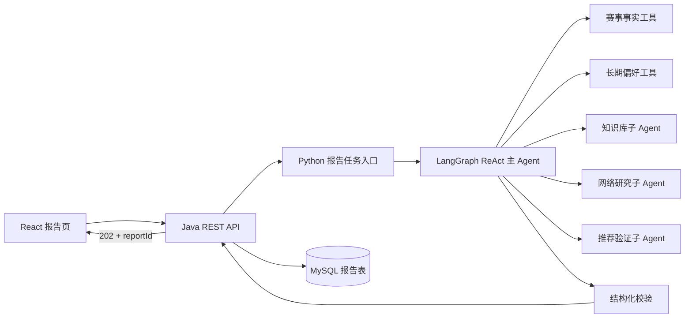

# Python 报告 Agent 技术规格

**状态：** 已确认 v1.0  
**最后更新：** 2026-08-04  
**上级规格：** `00-总览与规范/00-系统总体设计与规格路线图.md`  
**依赖规格：** `07-Python Agent服务规格.md`、`04-功能规格/歌曲世界杯/05-赛后偏好报告与长图.md`

## 1. 目的与非目标

本 Agent 在一场歌曲世界杯结束后，分析用户在本场赛事中的选择，生成详细的偏好报告、歌曲推荐、艺人推荐和一段娱乐性观察。它是一个**赛事报告与音乐探索 Agent**，不是社交 Agent，也不是人工歌单编排产品。

首版支持：

- 当前已完成赛事的事实分析；
- 用户长期偏好档案作为可选输入（档案尚未实现时为空）；
- 受控的知识库检索和网络搜索；
- ReAct 主 Agent 自主决定是否使用工具；
- 复杂工具由子 Agent 封装后供主 Agent 调用；
- 固定长度的中文长报告和结构化推荐卡片数据。

首版不支持：

- Agent 直接修改赛事、投票或歌曲目录；
- Agent 直接访问 MySQL；
- 诊断心理、人格、教育背景、职业或健康状况；
- 无限网络浏览、歌词抓取、音频下载和绕过平台限制；
- 自动生成多场赛事的长期画像（但保留输入字段和版本扩展点）。

## 2. 已确认的技术决策

| 事项 | 决定 |
| --- | --- |
| 接入时机 | Java 在赛事完成后创建异步报告任务，返回 `202 Accepted`；前端轮询报告状态 |
| 输入范围 | 当前赛事事实 + 可选长期偏好档案；首版档案为空时不影响生成 |
| 主架构 | ReAct Agent；模型在工具调用和最终生成之间自主决策 |
| 工作流 | LangGraph 承载状态、循环、超时和终态；不是把固定模板误称为 Agent |
| 模型 | DeepSeek 为默认 Provider；保留 OpenAI 兼容的多供应商适配层 |
| 报告长度 | 固定长报告规格，正文约 1200–1800 个中文字符（卡片字段不计入正文） |
| 偏好维度 | 受控维度词表 + 模型在词表内自主选择，通常输出 3–5 项 |
| 推荐数量 | 通常输出 5–7 首歌曲、2–3 位艺人；数据不足时允许模型少给并说明原因 |
| 彩蛋 | 默认生成 80–120 字娱乐性观察，并强制附带限定语 |
| 外链 | Agent 只返回已验证的歌曲/艺人 ID；Java 负责补齐网易云搜索链接等外链 |
| 输出校验 | 严格 Pydantic JSON Schema；失败后进行受限修复，不接受自由文本兜底 |
| 证据 | 关键判断必须关联赛事对局事实；外部资料可作为可选补充证据 |
| 失败重试 | 初次运行失败后自动重试最多 2 次（总尝试次数最多 3 次） |
| 版本 | 每次成功生成形成递增版本；默认读取最新 `READY` 版本 |
| 持久化 | Java 持久化状态、版本和最终 JSON；Python 不写 MySQL |
| 可观测性 | 结构化日志 + trace，记录请求、阶段、时延、Token 用量和结果状态，不记录完整 Prompt/原文 |
| 评估 | 固定样本集自动回归 + LLM Judge；少量人工抽查，不把人工评分作为唯一门槛 |

固定长度是产品契约，不是硬截断。若模型输出超出范围，优先按字段级摘要压缩并重新校验；不得在句子中间直接截断。

## 3. 总体架构



### 3.1 服务边界

- Java 是任务状态、赛事权限、事实快照、实体 ID 和报告 JSON 的唯一权威方。
- Python 是无业务写入权限的推理服务；所有赛事事实通过 Java 内部只读接口取得。
- 外部搜索由 Python 工具访问，但只能返回摘要、标题、URL 和来源时间等受限字段。
- React 只访问 Java 公共 API，不直接访问 Python、Milvus 或搜索服务。

### 3.2 “固定工作流还叫不叫 Agent”

固定工作流只是外层生命周期约束：读取输入、运行、校验、落库。真正的分析节点是 ReAct Agent：它根据当前证据自主判断是否查询知识库、是否搜索网络、是否请求某个子 Agent，以及何时结束。这样既保留可观测、可超时、可重试的工程边界，又保留 Agent 的工具决策能力。

## 4. 输入契约

```json
{
  "requestId": "uuid",
  "reportId": "uuid",
  "tournamentId": "uuid",
  "tournamentVersion": 1,
  "factsEndpoint": "/internal/v1/tournaments/{id}/report-facts",
  "longTermProfile": null,
  "constraints": {
    "bodyCharRange": [1200, 1800],
    "songRecommendationRange": [5, 7],
    "artistRecommendationRange": [2, 3],
    "dimensionRange": [3, 5],
    "includePersonalityEasterEgg": true
  }
}
```

`longTermProfile` 预留为版本化结构。它只能包含用户主动产生、已脱敏且有来源的偏好摘要；不得传入聊天原文、敏感个人信息或未经同意的推断结果。

## 5. ReAct 主 Agent

### 5.1 状态

LangGraph 状态至少包含：

- `request_id`、`report_id`、`tournament_id`；
- `facts_snapshot`、`long_term_profile`；
- `evidence_registry`（证据 ID、来源和适用范围）；
- `tool_calls`（工具名、参数摘要、状态、耗时）；
- `draft_report`；
- `validation_errors`、`attempt`、`warnings`。

状态仅存于当前任务和受控 checkpoint，不作为跨用户记忆。

### 5.2 运行循环

1. 读取并校验 Java 事实快照；
2. 提取赛事信号：晋级路径、相邻选择、艺人/专辑分布和不确定性；
3. ReAct 决定是否调用知识库、网络研究或推荐验证子 Agent；
4. 生成报告草稿和证据映射；
5. 执行 Schema、实体、数量、证据和安全校验；
6. 校验失败时只把错误摘要反馈给模型进行一次受限修复；
7. 返回 `READY` 或结构化失败原因。

模型不得输出或暴露思维链。日志只保存工具调用摘要和最终可见文本。

## 6. 工具与子 Agent

主 Agent 可以自主选择工具，但工具均为白名单、参数化和可超时的函数。首版实现以下工具：

| 工具 | 作用 | 访问范围 |
| --- | --- | --- |
| `get_tournament_facts` | 读取本场赛事事实 | Java 内部只读 API |
| `get_long_term_profile` | 读取可选长期偏好摘要 | Java 内部只读 API；无档案时返回空 |
| `search_music_catalog` | 按实体、艺人、标题检索候选 | Java 音乐目录 |
| `search_knowledge_base` | 检索已审核音乐知识 Claim | Milvus/知识服务 |
| `web_search` | 搜索公开网页并返回受限摘要 | 可配置搜索 Provider |
| `resolve_music_entities` | 将候选名称解析为规范歌曲/艺人 ID | Java 目录 + 匹配规则 |
| `validate_recommendations` | 校验实体、重复、推荐数量和外链所需字段 | Java 内部校验 API |

### 6.1 子 Agent 模式（必须实现）

复杂工具不直接把内部过程暴露给主 Agent，而是通过子 Agent 作为工具调用。首版至少实现三个子 Agent：

1. **知识检索子 Agent**：查询 Milvus，合并相似 Claim，返回摘要和 Claim ID；不得生成新事实。
2. **网络研究子 Agent**：调用白名单搜索 Provider，去重、过滤低质量页面，只返回标题、URL、摘要和来源时间；不得抓取歌词或媒体。
3. **推荐验证子 Agent**：依据主 Agent 给出的方向调用目录检索和实体解析，返回可用 ID、匹配理由和缺失项；不得擅自改变赛事结果。

子 Agent 使用独立 Pydantic 输入/输出、独立超时和最大工具调用次数。主 Agent 只能看到其结构化结果，不能依赖隐藏文本或未声明状态。子 Agent 失败时返回 `tool_unavailable`，由主 Agent 决定降级或继续。

### 6.2 工具决策边界

- 赛事事实、冠军和投票路径必须来自 Java，不允许网络搜索替代。
- 推荐实体必须经过 `resolve_music_entities` 或 Java 目录校验。
- 网络搜索不是每次必调；当本地 Claim 足够时，主 Agent 应跳过网络调用。
- 不允许工具修改 MySQL、投票、赛事状态或用户档案。
- 每个主 Agent 运行最多 8 次工具调用，每个子 Agent 最多 3 次；达到上限必须生成降级报告或失败。

## 7. 报告输出契约

```python
class EvidenceRef(BaseModel):
    evidence_id: UUID
    source_type: Literal["match", "vote", "catalog", "knowledge", "web"]
    source_id: UUID | None = None
    source_url: HttpUrl | None = None

class PreferenceDimension(BaseModel):
    name: str
    confidence: Literal["low", "medium", "high"]
    explanation: str
    evidence: list[EvidenceRef] = Field(min_length=1, max_length=5)

class SongRecommendation(BaseModel):
    recording_id: UUID
    reason: str
    evidence: list[EvidenceRef] = Field(default_factory=list, max_length=5)

class ArtistRecommendation(BaseModel):
    artist_id: UUID
    reason: str
    evidence: list[EvidenceRef] = Field(default_factory=list, max_length=5)

class PreferenceReport(BaseModel):
    schema_version: Literal["1.0"]
    tournament_id: UUID
    tournament_version: int
    summary: str
    dimensions: list[PreferenceDimension] = Field(min_length=3, max_length=5)
    song_recommendations: list[SongRecommendation] = Field(min_length=5, max_length=7)
    artist_recommendations: list[ArtistRecommendation] = Field(min_length=2, max_length=3)
    personality_easter_egg: str = Field(min_length=80, max_length=120)
    disclaimer: str
    warnings: list[str] = Field(default_factory=list)
```

数量不足时，Agent 可在 `warnings` 中说明并返回降级状态；Java 不得为了满足数量而填充未验证实体。`summary` 和各项解释必须是中文、可直接展示的文本。

## 8. 证据与自由决策

采用“硬证据 + 软证据”混合方式：

- **硬证据（必须）**：偏好维度至少引用一条 `match` 或 `vote`；冠军、晋级路径和赛事规模只能引用赛事事实。
- **软证据（可选）**：`knowledge` 或 `web` 可用于解释音乐背景、风格关联和推荐理由，但不能覆盖硬证据。
- Agent 可以自主决定证据组合和是否搜索；校验器只检查最低证据要求，不强迫每个推荐都调用网络。
- 不确定时使用“可能、倾向于、从本场选择看”等措辞，并降低置信度。

## 9. 失败、重试与幂等

- Java 创建任务时生成幂等键：`tournamentId + requestedVersion`。
- 同一版本已有 `READY` 报告时直接返回，不重复消耗模型额度。
- 模型超时、429、5xx、暂时性 Provider 错误：自动重试最多 2 次，采用指数退避；总尝试最多 3 次。
- Schema 错误：每次尝试内部最多 1 次受限修复；不得因格式错误无限循环。
- 事实快照不存在、赛事未完成、权限失败或推荐实体不足：不重试，写入结构化失败原因。
- 最终失败仍保留 `FAILED` 报告记录、失败码和可重试提示，不保存半成品报告。

## 10. 评估与可观测性

### 10.1 自动评估

维护一组脱敏、固定的赛事样本集，自动检查：

- JSON Schema 合规率、实体 ID 命中率、重复率和数量范围；
- 事实引用覆盖率、推荐理由与证据的一致性；
- 越界推断检测（心理诊断、教育背景、职业、确定性人格标签）；
- 报告长度、中文可读性和失败重试行为。

使用独立 LLM Judge 对相关性、证据充分性、表达自然度和越界风险进行 1–5 分评估；Judge 只作为辅助信号，不覆盖硬性契约失败。

### 10.2 日志与追踪

每次任务记录：`requestId`、`reportId`、Provider、模型、尝试次数、工具调用摘要、各阶段耗时、输入/输出 Token（若 Provider 提供）、最终状态和错误码。禁止记录 API Key、完整 Prompt、完整网页原文和隐藏思维链。日志中的用户文本需脱敏或截断。

## 11. 验收标准

- [ ] Java 完成赛事后返回 `202` 和可轮询的报告 ID；
- [ ] ReAct 主 Agent 至少能在“只用赛事事实”和“调用一个子 Agent”两条路径成功完成；
- [ ] 三个子 Agent 均有独立契约、超时和失败降级测试；
- [ ] 成功报告满足 Schema、数量、长度和证据最低要求；
- [ ] 推荐 ID 均能被 Java 复核并生成卡片外链；
- [ ] 模型或网络暂时失败时最多自动重试两次，最终状态可解释；
- [ ] Agent 无法直接访问 MySQL，且无法修改赛事或投票；
- [ ] 固定样本集回归和 LLM Judge 流程可重复执行；
- [ ] 日志不泄露密钥、Prompt、网页全文或思维链。

## 12. 实施顺序

1. 抽象 Provider、Pydantic 输入/输出和 Java 事实工具；
2. 实现 ReAct 主 Agent 的“事实读取 → 分析 → 校验”最小闭环；
3. 实现推荐验证子 Agent，并接通本地音乐目录；
4. 实现知识检索和网络研究子 Agent（网络 Provider 可配置）；
5. 接入异步任务、重试、报告状态回写和 Java 持久化；
6. 建立固定样本集、LLM Judge 和可观测性；
7. 与 React 报告页面和长图导出联调。
