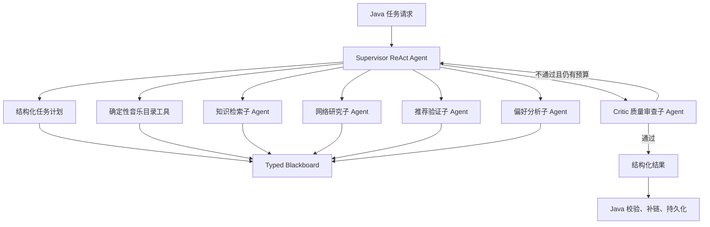

# Agent 运行时与多 Agent 协作深化规格

**状态：** 已确认 v1.0  
**最后更新：** 2026-08-05  
**上级规格：** `00-总览与规范/00-系统总体设计与规格路线图.md`  
**依赖规格：** `07-Python Agent服务规格.md`、`09-Python报告Agent技术规格.md`、`04-功能规格/歌曲世界杯/03-Agent候选池确认与开赛.md`、`04-功能规格/歌曲世界杯/05-赛后偏好报告与长图.md`

## 1. 设计目标

IndieSoundQuest 的 Agent 不是一次性调用大模型的文本接口，而是一套可复用的音乐探索智能运行时。它需要同时支持两类技能：

1. **候选池生成技能**：理解用户偏好，召回歌曲，控制多样性，生成主候选池和备用池；
2. **赛后报告技能**：读取赛事事实，提取偏好信号，形成带证据的偏好假设，发现并验证推荐，生成报告。

两类技能共享运行时、工具协议、实体解析、证据注册表、质量审查、重试和评估机制，但不共享未经授权的用户状态，也不互相修改业务数据。

### 1.1 非目标

- 不做社交、公开排行或用户间推荐；
- 不让 Agent 直接修改歌曲目录、赛事、投票或报告数据库；
- 不把用户的音乐选择解释为心理诊断、教育背景、职业或健康结论；
- 不使用无限循环、自主爬虫、歌词抓取或音频下载来制造“智能感”。

## 2. 总体架构



### 2.1 为什么是 Supervisor ReAct

外层使用 LangGraph 管理生命周期、超时、重试和终态；核心分析由 Supervisor ReAct Agent 完成。Supervisor 可以根据当前证据决定：

- 是否需要继续检索；
- 选择本地目录、知识库还是网络搜索；
- 是否委托给某个子 Agent；
- 是否需要更换推荐方向；
- 是否已达到足够证据并结束。

因此，LangGraph 的节点图不是把固定模板伪装成 Agent，而是提供 Agent 自主循环可控运行的工程边界。

## 3. 共享 Agent Runtime

### 3.1 运行上下文

每次运行创建不可变的 `RunContext`：

```python
class RunContext(TypedDict):
    request_id: UUID
    run_id: UUID
    user_scope: str
    skill: Literal["candidate_generation", "tournament_report"]
    model_policy: ModelPolicy
    deadline_at: datetime
    max_tool_calls: int
    max_subagent_calls: int
```

`user_scope` 只由 Java 传入并由 Java 校验。Agent 不自行解释访客身份，也不把访客标识写进报告正文。

### 3.2 Typed Blackboard

Agent 之间通过类型化黑板交换结构化事实，不通过自然语言长文本互相转述：

```python
class AgentBlackboard(TypedDict):
    context: RunContext
    plan: TaskPlan
    facts_snapshot: TournamentFacts | None
    preference_profile: PreferenceProfile | None
    preference_signals: list[PreferenceSignal]
    candidate_pool: CandidatePool | None
    evidence_registry: EvidenceRegistry
    entity_registry: EntityRegistry
    tool_call_history: list[ToolCallRecord]
    draft_output: CandidateDraft | PreferenceReportDraft | None
    critique: CritiqueResult | None
    validation_errors: list[ValidationError]
    warnings: list[AgentWarning]
```

黑板规则：

- 每个节点声明可读字段和可写字段；
- 赛事事实只能由 Java 事实工具写入；
- 规范实体只能由目录工具或实体解析工具登记；
- 子 Agent 不能直接覆盖主 Agent 的事实、投票或赛事状态；
- 黑板只属于当前运行，不作为跨用户长期记忆；
- 必须支持 checkpoint 和运行回放，但回放数据需脱敏。

## 4. 结构化任务计划

Supervisor 首轮必须生成 `TaskPlan`，随后可以根据工具结果追加、删除或重新排序步骤：

```json
{
  "goal": "生成赛后偏好报告",
  "steps": [
    {"id":"s1", "action":"读取赛事事实", "required":true, "status":"pending"},
    {"id":"s2", "action":"提取偏好信号", "required":true, "status":"pending"},
    {"id":"s3", "action":"发现推荐候选", "required":true, "status":"pending"},
    {"id":"s4", "action":"绑定证据并生成报告", "required":true, "status":"pending"},
    {"id":"s5", "action":"质量审查", "required":true, "status":"pending"}
  ]
}
```

计划必须满足：

- 步骤动作来自白名单；
- 每步有输入、输出和完成条件；
- 工具错误可以触发降级步骤，但不能跳过必需事实读取；
- 计划修改次数最多 4 次；
- 不能由模型动态创建任意 Python 函数或任意网络请求。

## 5. Supervisor ReAct 循环

```text
读取当前黑板
  ↓
判断下一个未完成步骤
  ↓
选择确定性工具或子 Agent
  ↓
观察结构化结果
  ↓
更新黑板与证据注册表
  ↓
判断：继续、调整计划、提交审查或失败
```

每一轮必须产生结构化 `Decision`：

```json
{
  "decision": "call_subagent",
  "target": "recommendation_validator",
  "reasonCode": "local_candidates_need_entity_validation",
  "expectedOutput": "validated_music_entities"
}
```

不记录或输出隐藏思维链，只保留可审计的决策代码、目标工具和结果摘要。

### 5.1 预算

默认单次运行预算：

- 主 Agent 工具调用最多 8 次；
- 子 Agent 调用最多 6 次；
- 单个子 Agent 最多调用工具 3 次；
- 计划调整最多 4 次；
- 总运行时间 90 秒；
- 达到任一上限后进入降级生成或结构化失败。

预算由运行时强制执行，模型不能自行提高预算。

## 6. 子 Agent 体系

复杂任务必须通过子 Agent 封装为结构化能力。子 Agent 不拥有主任务的最终决策权。

### 6.1 偏好分析子 Agent

输入：赛事事实、投票路径、可选长期偏好。  
输出：偏好信号和带置信度的偏好假设。

```json
{
  "name": "叙事推进感",
  "confidence": "medium",
  "hypothesis": "用户可能偏好情绪逐步展开、叙事线索明显的作品",
  "supportingEvidenceIds": ["match-01", "match-07"],
  "counterEvidenceIds": ["match-04"]
}
```

它只能分析已提供的音乐选择，不能作现实身份推断。

### 6.2 知识检索子 Agent

- 查询 Milvus 中已审核 Claim；
- 合并重复结果并返回 Claim ID；
- 不生成新事实；
- 不把相似度分数直接展示给用户；
- 无结果时返回 `knowledge_not_found`。

### 6.3 网络研究子 Agent

- 调用配置的搜索 Provider；
- 对结果去重、过滤低质量来源；
- 只返回标题、URL、摘要、来源时间和可信度等级；
- 不抓取歌词、媒体文件或需要登录的内容；
- 网络资料不能替代 Java 事实和规范实体校验。

### 6.4 推荐验证子 Agent

- 根据偏好方向检索歌曲和艺人；
- 调用实体解析和目录校验；
- 检查重复、艺人集中度、推荐数量和展示字段；
- 返回可用实体 ID、理由和缺失项；
- 不改变赛事冠军或用户投票。

### 6.5 Critic 质量审查子 Agent

Critic 独立于生成模型，至少检查：

- 事实是否来自赛事快照；
- 偏好假设是否有匹配或投票证据；
- 推荐是否与偏好信号相关；
- 实体 ID 是否已验证；
- 是否出现编造、确定性人格标签或越界推断；
- 报告长度、数量、语言和免责声明是否满足契约。

Critic 最多运行两轮。第一次不通过时，返回结构化修复项；第二次仍不通过则任务失败或降级，不允许无限反思。

## 7. 候选池生成技能

候选池使用“理解 → 召回 → 重排 → 验证”的多阶段流程。

### 7.1 偏好理解

从用户输入中提取：

- 明确点名的艺人、歌曲或专辑；
- 语言、时代、场景和情绪；
- 风格、编曲密度、人声特征和叙事倾向；
- 不确定或矛盾的描述。

模型可以自由选择有效维度，但维度必须来自受控词表或经过解释的扩展维度。

### 7.2 候选召回

召回来源按优先级排序：

1. Java 规范音乐目录；
2. Milvus 已审核音乐关系；
3. 网络研究子 Agent 的公开资料；
4. 经过实体解析后的新候选。

大模型不得直接编造歌曲 ID。候选池始终生成 `activeCandidates` 和 `reserveCandidates`，以支持用户移除后补位。

### 7.3 多样性重排

重排目标同时考虑：

- 与用户偏好的相关性；
- 艺人、专辑、时代和风格的覆盖度；
- 相似候选去重；
- 用户明确偏好的保留；
- 16/32 首赛事的可玩性。

重排结果必须附带可解释的 `selectionReason`，但理由只能引用已登记的信号或证据。

### 7.4 验证

候选进入前端前必须通过：

- 规范实体校验；
- 标题/艺人/专辑完整性校验；
- 封面状态校验；
- 去重校验；
- 数量与补位池校验；
- 禁止内容和来源边界校验。

## 8. 赛后报告技能

报告使用以下中间层，而不是直接生成最终文案：

```text
赛事事实
  ↓
投票信号
  ↓
偏好假设
  ↓
证据绑定
  ↓
候选推荐
  ↓
推荐验证
  ↓
报告生成
  ↓
Critic 审查
```

偏好假设必须包含支持证据和反向证据。没有证据的观察只能作为低置信度描述，不能作为报告主结论。

## 9. 工具协议

所有工具都实现统一协议：

```python
class AgentTool(Protocol):
    name: str
    description: str
    input_schema: type[BaseModel]
    output_schema: type[BaseModel]
    timeout_seconds: float

    async def invoke(
        self, input: BaseModel, context: RunContext
    ) -> BaseModel: ...
```

首版工具白名单：

- `get_tournament_facts`
- `get_long_term_profile`
- `search_music_catalog`
- `resolve_music_entities`
- `search_knowledge_base`
- `web_search`
- `validate_recommendations`
- `submit_for_critique`

工具结果必须经过 Pydantic 校验并登记到 `evidence_registry` 或 `entity_registry`。工具不能访问任意 URL，网络搜索 Provider 由适配器配置。

## 10. 模型路由

首版全部默认使用 DeepSeek，但保留按任务路由的接口：

| 任务 | 默认路由 |
| --- | --- |
| Supervisor 规划与工具决策 | DeepSeek 主模型 |
| 偏好信号提取 | DeepSeek 或低成本兼容模型 |
| 长报告生成 | DeepSeek 主模型 |
| Critic 审查 | 独立 Judge Provider，可配置 |
| 网络摘要 | 可配置兼容模型 |

路由策略必须记录 Provider、模型、耗时和 Token 用量。API Key 只能来自环境变量或密钥管理系统，不进入黑板、日志或报告。

## 11. 记忆与长期偏好

首版分为两种记忆：

- **运行记忆**：当前任务的 Typed Blackboard 和 checkpoint，任务结束后不可作为其他用户上下文使用；
- **长期偏好档案**：预留的版本化摘要，只有用户主动产生且经过脱敏、确认或明确来源后才能被读取。

长期档案不保存完整聊天记录，不保存隐藏推断，不保存人格标签。后续实现时由 Java 管理权限和版本，Agent 只能读取。

## 12. 失败与恢复

- 临时网络、模型 429/5xx：按共享运行时策略重试，最多两次；
- 工具无结果：主 Agent 可换工具或降低结论置信度；
- 实体无法解析：丢弃实体并补充候选，不允许编造；
- Critic 不通过：最多两轮修复；
- 预算耗尽：返回已验证的降级结果或结构化失败；
- 赛事事实、权限或版本冲突：立即失败，不进行模型重试。

所有失败必须带有稳定错误码、可重试标识和 `requestId`。

## 13. 评估体系

建立固定脱敏样本集，覆盖：

- 明确艺人偏好；
- 模糊风格偏好；
- 跨艺人探索；
- 矛盾或过短输入；
- 目录不足和网络不可用；
- 16 首和 32 首候选池；
- 完整赛事和极少投票证据。

自动指标包括：

- 规范实体命中率；
- 候选重复率和多样性；
- 事实证据覆盖率；
- Schema 合规率；
- 工具调用成功率；
- 平均工具调用次数和单次耗时；
- Critic 拦截率；
- 越界推断率。

LLM Judge 辅助评估相关性、解释质量、自然度和越界风险，但以下规则失败时直接判定不合格：实体未验证、赛事事实错误、泄露隐私、输出无法解析。

## 14. 实现顺序

1. 定义共享 Typed State、工具协议、运行预算和错误码；
2. 实现 Supervisor ReAct 的计划—行动—观察循环；
3. 接入 Java 事实、音乐目录和实体解析工具；
4. 实现偏好分析子 Agent 和推荐验证子 Agent；
5. 实现候选池生成技能并替换现有候选生成逻辑；
6. 实现知识检索、网络研究和 Critic 子 Agent；
7. 接入赛后报告技能、异步任务和 Java 持久化；
8. 建立固定样本集、LLM Judge、运行回放和指标面板。

## 15. 验收标准

- [ ] 候选池和赛后报告使用同一套 Agent Runtime；
- [ ] Supervisor 能动态决定是否调用工具或子 Agent；
- [ ] 计划可以根据工具结果修改，但受次数和预算限制；
- [ ] 所有子 Agent 都有独立输入输出契约和超时；
- [ ] 候选池经过召回、多样性重排和实体验证；
- [ ] 报告经过偏好假设、证据绑定、推荐验证和 Critic 审查；
- [ ] Agent 无法直接访问 MySQL 或修改赛事业务数据；
- [ ] 运行过程可回放，日志不包含完整 Prompt、密钥或隐藏思维链；
- [ ] 固定样本集可以重复评估两类技能；
- [ ] 模型、网络、知识库不可用时能够按规范降级或失败。
