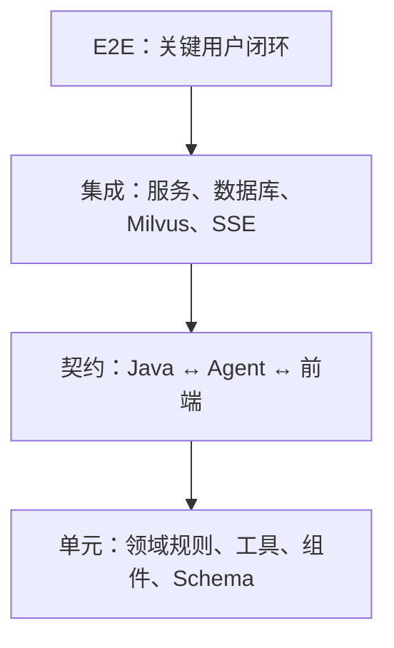

# 质量评估与可观测性规格

**状态：** 草案 v0.1  
**最后更新：** 2026-08-01  
**上级规格：** `00-系统总体设计与规格路线图.md`  
**关联规格：** `03-MVP产品规格：歌曲世界杯与音乐探索.md`、`05-Agent工作流规格.md`、`06-Java业务服务规格.md`、`07-Python Agent服务规格.md`、`09-Milvus知识库与事实治理规格.md`

## 1. 目标

确保系统不仅“能跑”，还能够证明：赛事结果正确、跨平台资源未错配、Agent 不编造关键音乐事实、用户数据安全私有，并能定位失败、延迟与模型成本。

## 2. 质量维度

| 维度 | 关键问题 | 主要责任 |
| --- | --- | --- |
| 业务正确性 | 16/32 首赛事、投票、晋级、冠军是否正确 | Java 服务 |
| 数据正确性 | 歌曲版本、Provider Mapping、试听是否绑定正确 | 实体/Provider 层 |
| Agent 可靠性 | 策展、总结、推荐是否遵守证据与安全边界 | Python Agent |
| 知识质量 | Claim 是否有来源、审核状态是否生效 | 知识库管道 |
| 用户体验 | 赛事是否可恢复、失败时是否有降级 | Web + Java |
| 性能与成本 | 调用延迟、Token、工具失败和模型成本是否可控 | 全链路 |
| 隐私与安全 | 是否泄露其他用户、密钥或受限内容 | 全链路 |

## 3. 测试分层



### 3.1 单元测试

| 模块 | 必测规则 |
| --- | --- |
| Java 赛事领域 | 16/32 赛程数、唯一候选、胜者推进、决赛完成、删除失效 |
| Java 投票 | 权限、一次性投票、幂等键、并发冲突、状态机 |
| 实体匹配 | ISRC 优先、标题/艺人/时长评分、版本冲突、低置信拒绝 |
| Python Graph | 状态转换、工具失败降级、候选覆盖、结果校验 |
| Agent Validator | 来源覆盖、敏感推断拦截、未解析实体 ID 拦截 |
| Web | 候选数量、投票禁用、错误重试、SSE 映射、无试听降级 |

### 3.2 契约测试

- Java 对 Agent 请求、SSE 事件和最终 JSON Schema；
- Agent 对 Java 内部实体、赛事快照、用户信号响应；
- 前端对 Java REST 错误格式和 SSE 用户可见事件；
- Provider Adapter 对 MusicBrainz/Apple 标准化 DTO；
- Milvus 工具对 `REVIEWED` Claim 过滤与 Claim 回查。

使用 JSON Schema 或 Pydantic/OpenAPI 导出物作为契约来源。契约变化必须在 CI 中同时验证调用方和被调用方。

### 3.3 集成测试

使用 Docker Compose 启动 MySQL、Redis、Milvus、Java 和 Agent 的测试实例。外部 Provider 与模型调用默认 Mock，避免测试依赖网络和产生费用。

必须覆盖：

1. 创建 16 首赛事，完成 15 票并原子产生冠军；
2. 并发投票和重复幂等键；
3. 创建 32 首探索赛事，Agent 草稿被 Java 重新校验；
4. Milvus 不可用、Agent 超时、Apple 无试听等降级；
5. 删除赛事后洞察/报告失效；
6. 访客与不同用户之间的访问隔离；
7. 服务重启后进行中赛事可恢复。

### 3.4 E2E 测试

Playwright 在浏览器中执行：

```text
创建经典赛事 → 连续投票 → 查看冠军和赛程
创建探索赛事 → 消费 Agent SSE → 确认草稿 → 完赛 → 查看总结
刷新进行中赛事 → 恢复正确对局
删除已完成赛事 → 历史和偏好报告状态更新
```

## 4. Agent 离线评估

### 4.1 测试集

维护版本化、人工标注的小型评估集，存放在仓库的受控测试目录中。测试样例只保存实体 ID、短事实、来源 URL 与期望性质，不保存完整歌词或受限文章。

覆盖：

- 中文艺人实体消歧；
- 曲目版本区分（studio/live/remaster）；
- 16/32 首候选池的唯一性和覆盖度；
- 资料充分与资料不足两种策展情形；
- 单场赛事结论的低置信度措辞；
- 多场赛事的相互矛盾偏好；
- 不应回答/不应推断的敏感属性请求；
- Milvus 返回无关或撤回 Claim 的负例。

### 4.2 自动检查项

| 指标 | 定义 | MVP 要求 |
| --- | --- | --- |
| 候选唯一性 | 不重复 `recording_id` 的比例 | 100% |
| 尺寸正确率 | 返回数量等于 16/32 的比例 | 100% |
| 版本冲突率 | 近重复版本被同时纳入的比例 | 0%（除非用户明确自选） |
| 引用覆盖率 | 关键事实有来源/用户投票标识的比例 | 100% |
| 推荐可解释率 | 推荐同时关联用户信号和音乐依据的比例 | 100% |
| 敏感推断率 | 输出敏感个人属性推断的比例 | 0% |
| 无依据断言率 | 缺少来源或信号的事实断言比例 | 趋近 0 |
| JSON Schema 成功率 | 最终输出通过结构化校验比例 | >= 99%（Mock 集） |

模型评审可作为辅助，不得替代上述确定性规则检查。任何生成式评审结果必须记录模型、Prompt 版本和样本集版本。

## 5. 可观测性设计

### 5.1 关联标识

所有 Web、Java、Agent、工具调用共享：

```text
request_id       # 一次外部业务请求
trace_id         # 分布式追踪
tournament_id    # 可选，赛事相关请求
agent_request_id # 可选，Agent 执行
```

`user_id`、`guest_session_id` 仅以不可逆哈希或内部匿名关联形式进入日志。

### 5.2 日志

使用 JSON 结构化日志，最低字段：

```text
timestamp, level, service, environment, request_id, trace_id,
route_or_workflow, latency_ms, status_code, error_code
```

禁止记录：密码、Token、Cookie、API Key、完整歌词、音频 URL、完整网页正文、完整模型 Prompt、其他用户的赛事数据。

### 5.3 指标

| 范围 | 指标 |
| --- | --- |
| Web | 页面错误率、赛事创建漏斗、SSE 断开率、无试听降级率 |
| Java | API 延迟/错误率、赛事完成率、投票冲突率、幂等命中率、删除成功率 |
| Agent | 各 Workflow 耗时、工具错误率、Schema 失败率、降级次数、重试次数 |
| 模型 | Provider、模型名、输入/输出 Token、估算成本、429/超时率 |
| 知识库 | 检索耗时、命中数、REVIEWED 过滤命中、Claim 撤回清理延迟 |
| Provider | MusicBrainz/Apple 响应时间、缓存命中、资源可用率 |

### 5.4 追踪

- OpenTelemetry 负责 HTTP、数据库、Redis、Agent 工具调用的 Trace；
- Langfuse 负责 LLM 调用、Prompt 版本、Token、工具与最终结构化结果元数据；
- 用户可见 SSE 阶段事件与内部 Span 名称可关联，但不暴露内部 Trace 给浏览器；
- 开发环境允许控制台导出 Trace，生产环境需接入受控后端。

## 6. 性能与成本预算

MVP 先记录实际分布，不在没有真实数据时虚构严格 SLA。以下为性能目标：

| 流程 | 目标 |
| --- | --- |
| 普通赛事读取/投票 | P95 < 500ms（不含媒体加载） |
| 艺人搜索（缓存命中） | P95 < 800ms |
| 探索赛事草稿 | 目标 < 30s，过程以 SSE 提示 |
| 赛后洞察 | 目标 < 20s，过程以 SSE 提示 |
| 整体偏好报告 | 目标 < 30s，过程以 SSE 提示 |

成本控制：

- 每次工作流限制网页查询、Claim 数、候选数和模型最大输出 Token；
- 同一输入版本的 Agent 请求使用幂等键和结果复用；
- 未达到整体偏好报告门槛时不调用 LLM；
- 开发/测试默认 Mock 模型，不消耗 DeepSeek Key；
- 每日统计模型成本、失败重试成本和人均调用量。

## 7. 发布门禁

合并主分支前必须满足：

- 单元、契约、集成测试通过；
- 关键 E2E 流程通过；
- 数据库迁移可在空库执行；
- API/Schema 兼容性检查通过；
- 密钥扫描、依赖漏洞扫描和基础静态检查通过；
- Agent 评估集中的唯一性、来源覆盖与敏感推断检查通过；
- Docker Compose 健康检查通过。

涉及 Prompt、模型、嵌入模型或检索策略变更时，必须重新跑 Agent 离线评估并记录结果版本。

## 8. 故障处理原则

| 事件 | 处理原则 |
| --- | --- |
| Java 投票错误 | 优先保证不重复、不丢票；前端刷新服务端事实 |
| Agent/模型异常 | 不改变已有赛事；保存受控失败状态，允许用户重试 |
| MusicBrainz/Apple 不可用 | 使用缓存或降级展示，不阻塞已创建赛事 |
| Milvus 不可用 | 禁用深度资料解释，保留赛事与基础推荐能力 |
| 来源撤回 | 停止返回对应 Claim，标记相关洞察/报告需重算 |
| 发现隐私泄露 | 立刻撤销密钥/访问、隔离日志、停止受影响服务并审计 |

## 9. 验收标准

- [ ] 全链路可通过 `request_id` 和 `trace_id` 关联；
- [ ] 日志和追踪不存在密钥、Cookie、完整歌词和完整网页正文；
- [ ] 赛事、Agent、知识库与前端关键流程均有自动化测试；
- [ ] Mock 环境可稳定跑完所有 CI 测试，不依赖外网；
- [ ] Agent 评估能自动拦截候选重复、无引用事实和敏感推断；
- [ ] 外部 Provider、Milvus 或模型不可用时，系统按规格降级；
- [ ] 可查看模型调用次数、Token、成本与失败原因；
- [ ] 删除赛事后对应聚合报告会在测试中被验证失效。

## 10. 不在本规格范围内

- 生产告警平台、值班制度和云监控产品的最终选择；
- 大规模压测、跨地域容灾与多活；
- 模型效果的人类大规模用户研究；
- 第三方 Provider 的服务等级协议。
