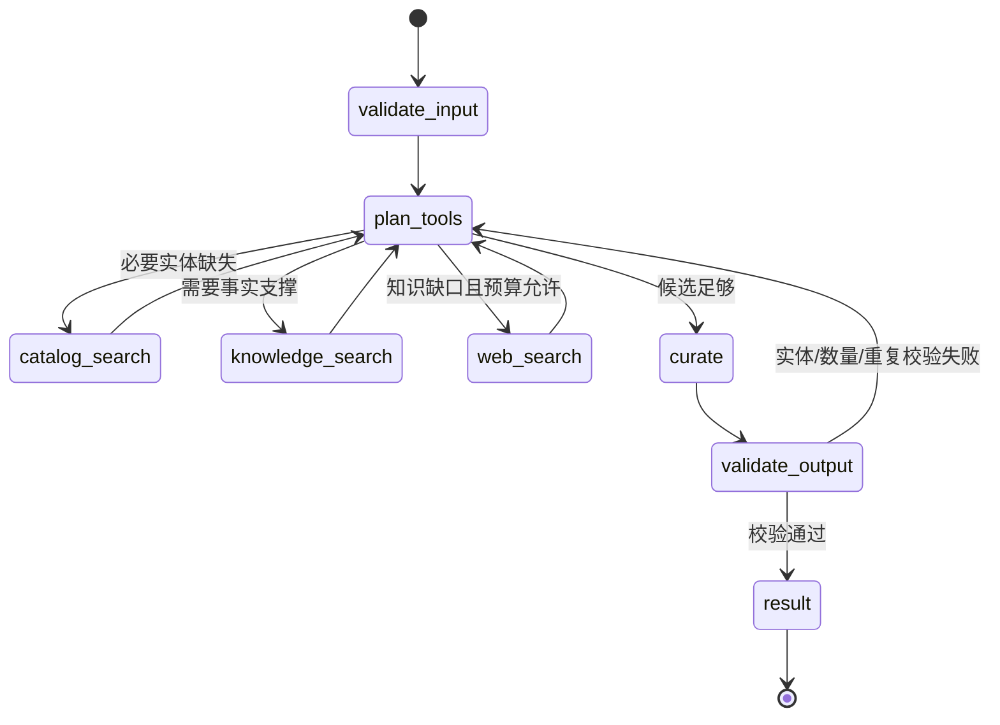

# Agent 候选池生成实现规格

**状态：** 草案 v0.1  
**最后更新：** 2026-08-02  
**所属功能域：** `04-功能规格/歌曲世界杯/`  
**关联规格：** `03-技术架构/05-Agent工作流规格.md`、`03-技术架构/07-Python Agent服务规格.md`、`02-音乐数据/04-音乐实体模型与跨平台匹配.md`

## 1. 目标与首版边界

用户用自然语言描述喜欢的歌曲、艺人、风格、场景或探索目标后，Agent 生成一份 **16 或 32 首歌曲的候选池草稿**。候选可跨艺人；用户确认草稿后，Java 服务才创建正式歌曲世界杯赛事。

本篇只负责“赛前候选池生成”，不生成赛后报告。Agent 不直连 MySQL；经 MusicBrainz 验证的新实体由 Java 目录服务幂等写入后，才可进入赛事。

## 2. 已确定的技术路线

| 项目 | 决定 |
| --- | --- |
| 编排架构 | LangGraph 实现 ReAct（Reason + Act）状态机 |
| 默认模型 | DeepSeek，使用 OpenAI-compatible Provider Adapter；保留多供应商扩展点 |
| Agent 工具 | Java 音乐目录、MusicBrainz 实体解析、Milvus、Tavily 网络搜索 |
| 事实与实体边界 | Agent 不可凭记忆创造歌曲；候选必须经 Java/MusicBrainz 规范实体校验 |
| 结果写入 | Agent 返回草稿；Java 复核 Recording 后创建 `AGENT_GENERATED` 赛事 |
| 前端可见性 | 显示候选、来源类型、简短策展理由与警告；不暴露内部思维链 |

Google Custom Search JSON API 已不向新客户开放，因此不采用。网络搜索封装为 `WebSearchProvider`，首个实现为 Tavily；未来可替换而不影响 Graph 节点。

## 3. 用户流程


输入例子：`我喜欢张悬的《玫瑰色的你》和陈绮贞早期作品，想找适合深夜散步的中文独立音乐。`

候选池是建议而非平台事实：每首歌需要来自受控目录，并附可解释的入选理由。资料或工具不足时，可降级为较少、较保守的候选，不能编造歌曲、艺人关系或来源。

## 4. ReAct Graph



- `plan_tools` 是 Supervisor ReAct 决策节点；每轮根据黑板选择下一项受控动作，而不是固定执行所有工具。
- 工具预算：MusicBrainz/目录查询最多 4 次、Milvus 最多 2 次、Tavily 最多 2 次；超限后进入保守策展。
- `curate` 只能从状态中的 `verified_recordings` 选择 `recordingId`。
- `validate_output` 在 Python 与 Java 两层执行：数量为 16/32、ID 唯一、实体存在、封面状态可展示；无法满足则返回 `insufficient_candidates`。

## 5. 工具契约

### 5.1 `music_catalog`

Python 通过 Java 内部 API 使用该工具；Java 统一处理 MusicBrainz 映射、缓存和规范 ID。

| 操作 | 输入 | 输出 |
| --- | --- | --- |
| `search_artists` | `query` | `artistId`、MBID、名称、置信度 |
| `search_recordings` | `query`、艺人/风格约束、`limit` | 规范 Recording、封面状态、来源 |
| `verify_recordings` | `recordingIds` | 可建赛的规范 Recording 或拒绝原因 |

Java 内部 API（仅 `agent-service` 所在内部网络可调用）：

```http
POST /internal/v1/music-catalog/search
Authorization: Bearer <AGENT_INTERNAL_SERVICE_TOKEN>
```

```json
{"query":"张悬 深夜散步","artistIds":["uuid"],"limit":80}
```

响应 `items[]` 至少包含 `id`、`title`、`artistId`、`artistName`、`albumTitle`、`coverStatus`。首版可按传入 `artistIds` 和本地规范 Recording 返回；自然语言 `query` 只用于将来跨艺人检索的排序，不得导致 Java 返回未入库的临时实体。

### 5.2 `knowledge_search`

查询 Milvus 的已审核 Claim，用于支持“发行时期、作品关联、场景/风格描述”等策展理由。没有结果不阻塞候选生成，但会降低理由表述强度。

首版集合名为 `music_claims`。Milvus 未就绪、Collection 不存在或没有 `reviewed` Claim 时，工具返回空列表与 `MILVUS_UNAVAILABLE` 警告；不得因而阻塞候选池。返回结构统一为 `claimId`、`summary`、`sourceUrl`、`score`，且只允许返回长度受限的 `summary`。

### 5.3 `web_search`

`WebSearchProvider.search(query, max_results=5)` 首版由 Tavily 实现。仅查询音乐相关公开资料，优先官方艺人/厂牌、正式采访和署名媒体；返回 URL、标题、受限摘要、发布日期。网页结果仅作本次临时证据，禁止下载歌词、音频、封面二进制或写入未经审核的 Milvus。

## 6. 内部 API 契约

```http
POST /internal/v1/workflows/candidate-pool:stream
Authorization: Bearer <AGENT_INTERNAL_SERVICE_TOKEN>
X-Request-Id: <uuid>
```

```json
{
  "requestId": "uuid",
  "guestId": "opaque-java-scoped-id",
  "size": 16,
  "preferenceText": "我喜欢…",
  "seedArtistIds": ["uuid"],
  "excludeRecordingIds": []
}
```

终态 `result`：

```json
{
  "requestId": "uuid",
  "status": "ready_for_confirmation",
  "size": 16,
  "recordingIds": ["uuid"],
  "curationSummary": "这组候选会在…之间帮助你做选择。",
  "items": [{"recordingId":"uuid","reason":"…","evidence":[{"kind":"web_source","sourceUrl":"https://..."}]}],
  "warnings": []
}
```

Java 对 `recordingIds` 进行最终复核；任何无效 ID 都使请求失败，不做静默替换。

## 7. 失败与降级

| 条件 | 行为 |
| --- | --- |
| DeepSeek 超时/不可用 | 返回 `MODEL_UNAVAILABLE`；前端引导使用代表作或自选候选 |
| Tavily 未配置/超时 | 继续使用目录与 Milvus，加入 `WEB_SEARCH_UNAVAILABLE` 警告 |
| Milvus 未就绪 | 不阻塞，理由只基于目录元数据与用户输入 |
| 可用规范歌曲不足 | 返回 `INSUFFICIENT_CANDIDATES`，不创建赛事 |
| 工具返回可疑/重复实体 | 由验证节点剔除；不能满足规模时失败 |

## 8. 验收标准

- [ ] 对含中文艺人和歌曲偏好的请求，生成 16/32 个不同、可被 Java 复核的 Recording ID；
- [ ] 同一请求在相同目录数据与固定模型/工具 Mock 下可复现；
- [ ] Agent 无法直接访问 MySQL 或创建赛事；
- [ ] 每一首候选都有用户可读理由；涉及外部事实时带 Claim 或 URL 来源；
- [ ] Tavily、Milvus 任一不可用时可明确降级或失败，不幻觉补全；
- [ ] 日志、SSE 与前端均不显示 Prompt、原始网页全文或模型思维链；
- [ ] Java 复核失败时，不产生半成品赛事。
