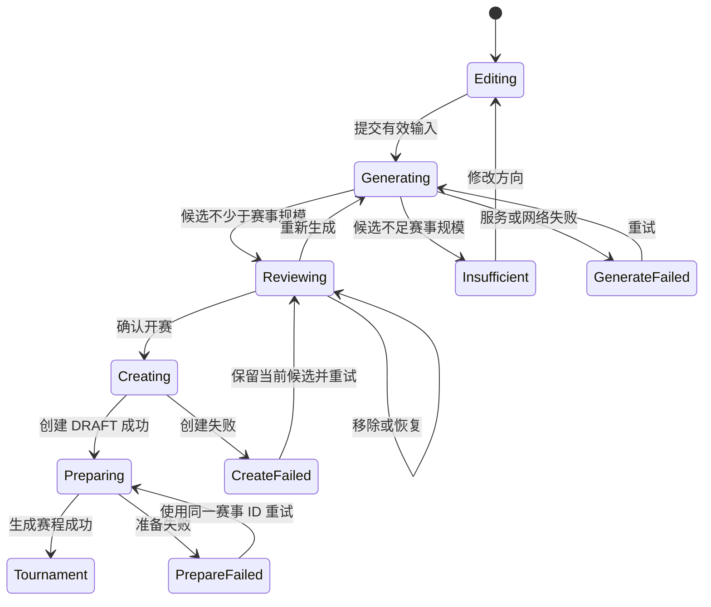

# Agent 候选池生成与确认页面闭环

**状态：** 可实施 v1.0
**最后更新：** 2026-08-10
**所属功能域：** `04-功能规格/歌曲世界杯/`
**前置规格：** `01-歌曲世界杯核心闭环.md`、`02-Agent候选池策展.md`
**架构约束：** `03-技术架构/05-Agent工作流规格.md`、`03-技术架构/11-双Agent-ReAct运行时落地规格.md`
**视觉子规格：** `04-前端视觉与候选确认体验.md`

## 1. 目标

完成以下可由真实用户独立走通的赛前闭环：

```text
输入感兴趣的音乐方向
  → 候选池生成 Agent 自主检索并生成候选
  → 用户查看、移除与恢复歌曲
  → 候补歌曲自动补位
  → 用户确认最终 16/32 首
  → Java 创建并准备世界杯
  → 进入第一场二选一对局
```

本功能的完成标准不是“页面能展示一组歌曲”，而是用户能够理解候选来源、低成本调整候选，并可靠进入已有赛事闭环。

## 2. 范围与非目标

### 2.1 本期范围

- 用户输入自由文本兴趣方向，可选起点艺人；
- 选择 16 或 32 首单败世界杯；
- 调用候选池生成 Agent；
- 展示 Agent 总结、歌曲卡片、生成理由和降级警告；
- 维护 active、reserve 与 removed 三种页面状态；
- 移除后自动补位，恢复后确定性重算；
- 确认最终 active 歌曲并创建、准备赛事；
- 跳转已有世界杯对局页；
- 记录不包含思维链的 ReAct 动作与工具结果摘要。

### 2.2 本期不做

- 新建第三个业务 Agent；
- 在确认页继续与 Agent 多轮聊天；
- 用户拖拽改变 Agent 排序；
- 候选池跨刷新持久化；
- 账号登录、跨设备恢复和社交分享；
- 在确认页生成赛后报告；
- 播放或托管完整音乐、歌词。

## 3. 统一术语

| 术语 | 含义 |
| --- | --- |
| `orderedItems` | Agent 返回并经 Java 复核后的完整有序候选，目标为赛事规模的两倍 |
| `activeItems` | 当前将要进入世界杯的前 16/32 首 |
| `reserveItems` | 当前 active 之后的候补队列 |
| `excludedIds` | 用户本次明确移除的 Recording ID 集合 |
| 候选池生成 Agent | 唯一负责赛前候选生成的业务 Agent；不是“策展 Agent” |
| 赛后报告 Agent | 赛事完成后生成报告的另一个业务 Agent；不参与本页面 |

用户界面、接口新增字段和新代码不再使用“策展”“curated”命名。历史数据库枚举 `AGENT_CURATED` 应迁移为 `AGENT_GENERATED`；兼容旧数据只允许存在于迁移或反序列化适配层。

## 4. 已确定的产品规则

1. 16 首赛事的目标候选量为 32；32 首赛事的目标候选量为 64。
2. Agent 可以跨艺人生成候选，起点艺人只是线索，不构成同艺人限制。
3. 最终进入页面的每首歌都必须具有 Java 内部 `recordingId`；Tavily 文本或模型记忆不能直接进入候选池。
4. 网络发现的歌曲必须先经 Java 调用 MusicBrainz 消歧并幂等导入。
5. 达到目标两倍数量时，active 与 reserve 数量相等；不足两倍但不少于开赛规模时允许降级确认，并展示候补不足警告。
6. 少于 16/32 首时不得创建赛事，页面回到可修改输入的不足状态。
7. 用户确认前不创建 Tournament、Entry 或 Match。
8. 候选调整全部在浏览器内完成；移除歌曲不重新调用 Agent，也不产生额外模型成本。
9. 用户确认时，Java 必须重新校验最终 active IDs，不能信任浏览器状态。
10. 候选生成 Agent 必须是受控 Supervisor ReAct；页面不得展示 chain-of-thought、Prompt 或未裁剪的工具响应。

## 5. 页面信息架构

首版继续使用现有单页入口，不强制先引入路由库。页面分为三个连续区域：

### 5.1 探索输入区

| 字段 | 规则 |
| --- | --- |
| 兴趣方向 | 必填，3–1000 字；支持艺人、歌曲、风格、场景和自然语言混合输入 |
| 起点艺人 | 可选，可选择零到多个内部 Artist；仅作为 Agent 线索 |
| 赛事规模 | 必选，16 或 32，默认 16 |
| 生成按钮 | 请求期间禁用，文案改为“正在寻找适合这场比赛的歌曲” |

输入示例只使用自然音乐表达，例如“张悬和安溥，克制、温柔、有留白的作品”，不使用 Prompt 工程术语。

### 5.2 Agent 结果摘要区

生成完成后展示：

- `candidateSummary`；
- “当前参赛 16/32 首”；
- “剩余候补 N 首”；
- 发生降级时的非阻塞警告；
- “重新生成”入口。

网络检索或 MusicBrainz 未被 Agent 使用不视为错误；只有工具确实失败且影响结果解释时才展示警告。不得为了显得 Agent 复杂而伪造进度阶段或工具调用。

### 5.3 候选确认区

默认只展示 activeItems；reserveItems 只显示剩余数量，不展开完整列表。每张卡片包含：

- 专辑封面或统一唱片标签占位；
- 歌名；
- 艺人；
- 专辑名（存在时）；
- Agent 给出的简短入选理由；
- “移除”按钮。

存在已移除歌曲时，在卡片区下方展示可折叠的“已移除”列表，每项可恢复。

## 6. 确定性的补位与恢复算法

前端只保存两个基础状态：

```ts
orderedItems: CandidateItem[] // 永不在本次确认过程中改变顺序
excludedIds: Set<RecordingId>
```

所有展示状态均派生计算：

```ts
eligibleItems = orderedItems.filter(item => !excludedIds.has(item.recordingId))
activeItems = eligibleItems.slice(0, size)
reserveItems = eligibleItems.slice(size)
removedItems = orderedItems.filter(item => excludedIds.has(item.recordingId))
```

### 6.1 移除

当且仅当 `eligibleItems.length > size` 时允许移除 active 歌曲：

1. 将该 `recordingId` 加入 `excludedIds`；
2. React 重新派生 activeItems；
3. 原 reserve 队首自然进入 active；
4. 使用轻量淡入提示“已由《歌曲名》补位”；
5. 不调用后端或 Agent。

当 `eligibleItems.length === size` 时，所有移除按钮禁用，并显示“候补已用完；你仍可恢复歌曲或重新生成”。

### 6.2 恢复

恢复任意已移除歌曲时：

1. 从 `excludedIds` 删除该 ID；
2. 根据原始 `orderedItems` 顺序重新派生 active 与 reserve；
3. 不依赖“最后一次操作”，因此支持任意顺序恢复；
4. 同一歌曲不可能同时出现在 active、reserve 和 removed 中。

该算法是本功能唯一允许的补位状态规则，避免维护相互漂移的三个可变数组。

### 6.3 重新生成与规模切换

- 点击重新生成：保留兴趣文本和起点艺人，清空 orderedItems 与 excludedIds，再发起新请求；
- 已有结果时切换 16/32：要求用户明确重新生成，不能直接截断旧结果；
- 离开页面或刷新：首版候选池丢弃，并明确提示用户重新生成。

## 7. 页面状态机



| 状态 | 必须保留的数据 | 用户可执行操作 |
| --- | --- | --- |
| `Editing` | 表单 | 编辑、生成 |
| `Generating` | 表单、requestId | 等待；不允许重复提交 |
| `Reviewing` | 表单、orderedItems、excludedIds | 移除、恢复、重新生成、确认 |
| `Insufficient` | 表单、警告 | 修改输入、缩小为合法规模、重试 |
| `GenerateFailed` | 表单 | 重试、返回直接开赛 |
| `Creating` | 最终 active IDs、幂等键 | 等待 |
| `Preparing` | tournamentId | 等待或重试 prepare |
| `CreateFailed` | 完整 Reviewing 状态 | 重试，不重新调用 Agent |

## 8. 浏览器到 Java 的 REST 契约

浏览器只调用 Java `/api/v1`；不得直连 Python Agent、Tavily、MusicBrainz 或 DeepSeek。

### 8.1 生成候选池

```http
POST /api/v1/candidate-pools
Content-Type: application/json
X-Request-Id: <uuid>

{
  "size": 16,
  "preferenceText": "张悬和安溥，克制、温柔、有留白的作品",
  "seedArtistIds": []
}
```

首版保持单次 HTTP 请求，不伪造流式步骤；Java 可等待 Agent SSE 完成后返回聚合结果。接口总超时上限为 150 秒。后续如真实 P95 超过 30 秒，再独立设计持久化任务与 SSE，不在本功能中同时引入两套协议。

成功响应：

```json
{
  "status": "ready_for_confirmation",
  "candidatePool": {
    "requestId": "uuid",
    "size": 16,
    "reserveSize": 16,
    "recordingIds": ["32 个有序内部 UUID"],
    "candidateSummary": "……",
    "items": [
      {
        "recordingId": "uuid",
        "title": "宝贝（In the Night）",
        "artistName": "张悬",
        "albumTitle": "My Life Will...",
        "coverUrl": "https://…",
        "coverStatus": "AVAILABLE",
        "reason": "……"
      }
    ],
    "warnings": []
  }
}
```

契约不变量：

- `recordingIds` 与 `items[].recordingId` 数量、顺序完全一致；
- ID 唯一且已由 Java 复核存在；
- `reserveSize = max(0, items.length - size)`；
- `ready_for_confirmation` 时 `items.length >= size`；
- 目标长度为 `size * 2`，但允许带 `RESERVE_CANDIDATES_INSUFFICIENT` 降级；
- Java 使用自身 Recording 数据补齐歌名、艺人、专辑和封面，不信任模型返回这些事实。

候选不足响应仍使用成功 HTTP 状态和业务状态：

```json
{
  "status": "insufficient_candidates",
  "candidatePool": {
    "size": 32,
    "reserveSize": 0,
    "recordingIds": [],
    "items": [],
    "candidateSummary": "已尝试本地目录与外部扩展，但可验证歌曲不足。",
    "warnings": [{"code": "INSUFFICIENT_CANDIDATES", "message": "……"}]
  }
}
```

### 8.2 确认并创建赛事

```http
POST /api/v1/tournaments
Content-Type: application/json
Idempotency-Key: <uuid>

{
  "size": 16,
  "candidateSource": "AGENT_GENERATED",
  "recordingIds": ["最终 activeItems 的 16 个 UUID"],
  "explorationBrief": "原始兴趣方向"
}
```

成功返回：

```json
{
  "id": "uuid",
  "status": "DRAFT",
  "size": 16,
  "candidateSource": "AGENT_GENERATED"
}
```

同一 `Idempotency-Key` 重试必须返回同一赛事，不得创建重复草稿。候补与 excluded IDs 不发送、不落入 TournamentEntry。

### 8.3 准备赛事

```http
PATCH /api/v1/tournaments/{tournamentId}
Content-Type: application/json

{"status":"READY"}
```

成功后跳转现有赛事页。创建成功但 prepare 失败时，前端保留 tournamentId 并仅重试 prepare，禁止重新创建赛事。

## 9. Java 端约束

1. Java 是候选事实与赛事写入的唯一信任边界。
2. 候选池响应前，Java 按 Agent 返回的全部 ID 批量读取 Recording，并验证数量、唯一性和存在性。
3. 创建赛事必须在单事务中验证最终 IDs、创建 Tournament 与 TournamentEntry；任一步失败不得留下半成品。
4. 跨艺人赛事的 `tournament.artist_id` 为 null；每个 Entry 从自身 Recording 生成艺人快照。
5. 创建接口必须支持幂等键；不能只依赖前端按钮禁用。
6. `explorationBrief` 保存用户原始兴趣方向，但不保存 Agent 隐含推理。
7. 历史 `AGENT_CURATED` 数据通过 Flyway 迁移到 `AGENT_GENERATED`，不得在新 API 继续传播旧术语。
8. 浏览器提交的歌名、艺人、封面和 reason 不参与赛事事实写入；只接受 recordingIds。

## 10. Agent 端约束

1. 使用 Supervisor ReAct 自主决定是否调用本地目录、Milvus、Tavily、MusicBrainz 解析与重排工具。
2. 禁止以固定 `catalog → web → MusicBrainz → rank` 顺序无条件执行。
3. 本地数量不足目标两倍时，在允许提交短 reserve 前必须至少尝试一次外部扩展。
4. 工具失败作为 observation 回写，不得直接让整个生成请求崩溃；只要仍有足够 active 候选即可降级完成。
5. 每轮动作来自白名单并受迭代数、网络次数、超时和成本预算控制。
6. 最终输出只含规范 recordingIds、简短理由、候选总结和警告。
7. 运行日志记录动作名称、成功/失败、数量、耗时和终止原因；不记录 chain-of-thought、密钥或完整用户画像。

## 11. 错误与用户文案

| 场景 | 业务码 | 页面行为 |
| --- | --- | --- |
| DeepSeek 决策失败但目录足够 | `MODEL_FALLBACK_USED` | 允许确认，提示“已使用目录规则完成排序” |
| Tavily 未使用 | 无警告 | 正常展示，不解释内部工具选择 |
| Tavily/MusicBrainz 失败但 active 足够 | `EXTERNAL_DISCOVERY_DEGRADED` | 允许确认，提示候补或跨艺人范围可能较少 |
| 候补少于 size | `RESERVE_CANDIDATES_INSUFFICIENT` | 显示实际剩余数，候补耗尽后禁用移除 |
| 总候选少于 size | `INSUFFICIENT_CANDIDATES` | 不显示确认按钮，引导修改方向或选择 16 首 |
| Java/Agent 暂不可用 | `CANDIDATE_POOL_UNAVAILABLE` | 保留输入，提供重试和直接开赛入口 |
| 确认 ID 被篡改或失效 | `TOURNAMENT_RECORDINGS_INVALID` | 保留页面，要求重新生成，不静默替换 |
| 创建请求结果不确定 | `CREATE_RESULT_UNKNOWN` | 使用同一幂等键查询/重试，不生成新键 |
| prepare 失败 | `TOURNAMENT_PREPARE_FAILED` | 保留 tournamentId，只重试 prepare |

用户文案只说明影响和下一步，不展示 Provider、HTTP 状态、堆栈或 Prompt。

## 12. 视觉、响应式与无障碍

- 延续“暖白唱片内页感”：暖白纸张、深墨文字、栗红强调、克制细线和极弱阴影；
- 不使用 emoji、聊天气泡、玻璃拟态、霓虹渐变和模板化 AI Hero；
- 桌面端最多四列，移动端两列；候选理由不可因卡片等高而被完全截断；
- 封面缺失时使用统一唱片标签占位，不出现破图；
- 移除、恢复、补位和错误消息使用 `aria-live`；
- 所有按钮支持键盘操作并具有可见焦点；
- 不能只用颜色区分 active、removed 或错误状态；
- 尊重 `prefers-reduced-motion`，补位动画可关闭；
- 外部来源链接使用新标签页和 `rel="noreferrer noopener"`。

## 13. 前端组件建议

```text
CandidatePoolExperience
├── ExploreForm
├── AgentGenerationStatus
├── CandidatePoolSummary
├── CandidateGrid
│   └── CandidateCard
├── RemovedCandidateList
├── CandidatePoolWarnings
└── ConfirmTournamentBar
```

首版继续使用 React 组件本地状态与派生 selector，不因本页面单独引入 Zustand、Redux 或 TanStack Query。API 封装与页面复杂度上升后再按 Web 总体规格迁移。

## 14. 测试要求

### 14.1 前端单元测试

- 32 项、size=16 时派生为 16 active + 16 reserve；
- 移除第一首后原第 17 首补位；
- 任意顺序移除三首再恢复中间一首，结果仍严格按 orderedItems 排序；
- reserve 耗尽时移除按钮禁用；
- 所有 active IDs 唯一且数量精确；
- 规模变化会要求重新生成而非复用旧池。

### 14.2 Java 集成测试

- Agent 返回重复、未知或少于 size 的 ID 时 Java 拒绝；
- 32/64 项候选均按原顺序补齐展示信息；
- 最终只写入 active 的 16/32 首；
- 跨艺人 Entry 快照正确；
- 相同幂等键不会创建两场赛事；
- 创建事务或 prepare 失败后可安全重试。

### 14.3 Agent 测试

- 本地目录足够时可以不调用网络工具；
- 本地不足两倍时，提交前会尝试外部扩展；
- MusicBrainz 超时会形成失败 observation 并触发重规划；
- 网络歌曲未解析成 recordingId 时不会进入结果；
- 16/32 首开赛数量不足时返回 insufficient；
- 不同输入能够产生不同的合法动作序列。

### 14.4 浏览器端到端验收

至少覆盖：

1. 输入方向并生成 16 + 16 候选；
2. 连续移除、恢复，确认页面无重复且数量稳定；
3. 确认开赛并进入第一场对局；
4. 刷新对局页可从 Java 恢复；
5. 候补不足、生成失败、创建失败和 prepare 失败的可恢复路径；
6. 375px 手机宽度与桌面宽度下完成同一流程；
7. 键盘完成表单、移除、恢复和确认操作。

## 15. 完成定义

- [ ] 用户无需理解 Agent 或工具即可完成“输入方向 → 调整候选 → 开赛”；
- [ ] 16 首赛事正常返回 32 首时，页面提供 16 个 active 和 16 个 reserve；
- [ ] 32 首赛事正常返回 64 首时，页面提供 32 个 active 和 32 个 reserve；
- [ ] 短 reserve 降级不会阻塞已有合法赛事，但影响被清楚说明；
- [ ] 任意移除与恢复操作均确定、可逆且不产生新模型调用；
- [ ] 最终提交精确、唯一且已验证的 16/32 个 Recording ID；
- [ ] 重复点击和网络结果不确定不会创建重复赛事；
- [ ] 成功后进入真实第一场对局，而不是停留在静态演示页；
- [ ] 页面符合暖白唱片内页视觉、响应式和无障碍要求；
- [ ] 前端、Java、Agent 与浏览器 E2E 测试全部通过；
- [ ] 运行日志能还原结构化 ReAct 动作，不暴露思维链或密钥。
