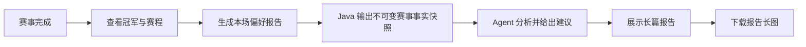

# 单场赛后偏好报告与长图

**状态：** 草案 v0.1  
**最后更新：** 2026-08-04  
**所属功能域：** `04-功能规格/歌曲世界杯/`  
**前置规格：** `01-歌曲世界杯核心闭环.md`、`03-Agent候选池确认与开赛.md`

## 1. 目标与边界

当一场歌曲世界杯完成后，用户可生成一份**详细的单场偏好报告**。报告基于该赛事的候选、逐场投票、晋级路径和冠军，给出可解释的听感偏好、探索建议、歌曲与艺人卡片，以及可选的人格彩蛋。报告可在页面中完整阅读，并导出为一张适合分享/保存的长图。

报告不是心理、教育背景、职业或医疗结论；人格彩蛋必须标明“娱乐性观察，仅基于本场音乐选择”。首版不汇总多场比赛，也不制作赛事总体长图。

## 2. 用户流程



同一赛事的报告首次生成后持久化；再次打开优先读取已生成版本。用户可手动“重新生成”一份新版本，旧版本保留到后续的数据清理能力上线。

## 3. 报告内容

1. **开场摘要**：冠军、比赛规模、完成的对局数及一段 80–160 字总结。
2. **本场选择轨迹**：冠军的晋级路径和 3–5 个最具信息量的选择，不把“胜出”表述为客观优劣。
3. **偏好维度**：3–5 个带置信描述的维度，例如叙事性、留白感、人声亲密度、编曲密度、情绪张力；每项关联至少一条本场事实。
4. **探索建议**：3–5 首歌曲与 2–3 位艺人，均有“为什么适合你”的简短理由和来源状态。
5. **人格彩蛋（可选）**：一段最多 120 字的娱乐性文本，避免人格标签、诊断和确定性措辞。
6. **免责声明**：明确“仅基于本场音乐选择，不代表心理或现实身份结论”。

## 4. 外链策略

首版歌曲卡和艺人卡显示“去听/搜索”外链，但不调用网易云、QQ 音乐或酷狗的非公开接口。

| 卡片 | 首版链接 | 原因 |
| --- | --- | --- |
| 歌曲 | 网易云音乐网页搜索 `https://music.163.com/#/search/m/?s={艺人+歌名}&type=1` | 仅生成普通链接，不抓取、不存储平台数据、不需要密钥 |
| 艺人 | 网易云音乐网页搜索 `https://music.163.com/#/search/m/?s={艺人}&type=100` | 允许用户自行选择正确条目 |
| 已有 Apple 映射 | 可选展示 Apple Music 外链 | 只在已有、已验证的映射存在时使用 |

未来若要“一键跳转到指定曲目详情”，新增 `external_platform_mapping` 规范映射表并仅接入有正式授权或稳定公开链接的平台；不得依赖爬虫 API。

## 5. 服务边界与 API

### 5.1 Java 事实快照

Python Agent 只能经 Java 内部 API 获取：赛事规模、候选展示快照、完成对局、各场胜者、冠军和创建时的探索说明。不得直接查询 MySQL，也不得获取其他访客赛事。

```http
GET /internal/v1/tournaments/{tournamentId}/report-facts
Authorization: Bearer <AGENT_INTERNAL_SERVICE_TOKEN>
```

Java 校验该赛事已 `COMPLETED`，并以调用链中的访客作用域校验归属。

### 5.2 对外 API

| 方法 | 路径 | 行为 |
| --- | --- | --- |
| `POST` | `/api/v1/tournaments/{id}/preference-report` | 首次生成或按 `force=true` 重新生成 |
| `GET` | `/api/v1/tournaments/{id}/preference-report` | 获取当前报告 |

生成响应为 `202 Accepted` 并返回 `reportId`。首版可由前端轮询 `GET` 直到状态为 `READY`，不额外引入第二套 SSE；Java 内部等待 Agent 的上限为 90 秒。

## 6. Agent 输出约束

Agent 使用 LangGraph 的“读取事实 → 可选知识/网页补充 → 生成 → 校验”流程。推荐歌曲或艺人必须来自 Java 规范目录；目录不足时可只给探索方向，不能编造曲目。

```json
{
  "summary": "…",
  "dimensions": [{"name":"叙事感","confidence":"中","explanation":"…","evidenceMatchIds":["uuid"]}],
  "songRecommendations": [{"recordingId":"uuid","reason":"…"}],
  "artistRecommendations": [{"artistId":"uuid","reason":"…"}],
  "personalityEasterEgg": "…",
  "disclaimer": "…"
}
```

Java 在保存和返回前复核所有 ID，并补齐封面、标题、外链与展示快照。模型失败时保留冠军与赛程，报告页面显示可重试状态。

## 7. 长图展示与下载

- 报告页本身是纵向的“暖白唱片内页”，适合长滚动阅读。
- 点击“下载报告长图”后，前端使用 `html-to-image` 或等价 DOM-to-PNG 工具生成 PNG；不上传用户数据到第三方截图服务。
- 导出使用专用 `.report-export` 容器，固定宽度 1080px、暖白底色、宋体标题、卡片网格降为单列。
- 外部封面加载不支持 CORS 时，导出自动使用本地生成的唱片标签占位，不因单张封面失败中断下载。
- 导出内容包含标题、冠军、摘要、维度、推荐、人格彩蛋和免责声明；不包含访客标识、Cookie、Prompt、原始工具数据。

## 8. 验收标准

- [ ] 完成 16/32 首赛事后可生成和再次打开单场报告；
- [ ] 每个维度都有本场赛事事实支持，推荐均为已验证规范实体；
- [ ] 歌曲和艺人卡包含可点击外链，首版无需任何国内平台 API 或登录；
- [ ] 人格彩蛋带娱乐性限定，不出现心理、教育、职业推断；
- [ ] 报告长图可下载为 PNG，封面跨域失败时仍能导出；
- [ ] 非赛事所有者不能读取、生成或间接获取报告事实；
- [ ] 页面不出现公开排行、社交分享计数或他人偏好信息。
