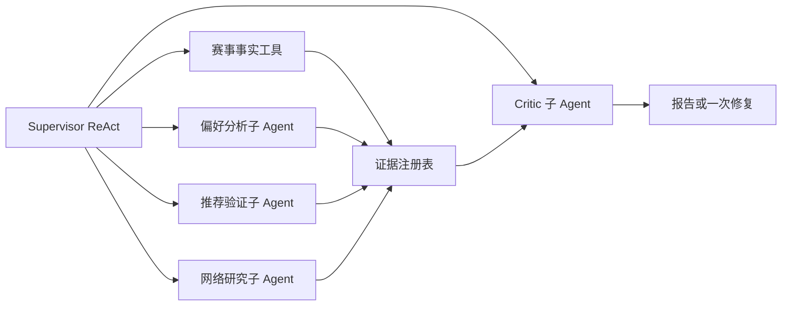

# 报告 Agent 子 Agent 与证据链

**状态：** 已确认 v1.0  
**最后更新：** 2026-08-07  
**前置规格：** `05-赛后偏好报告与长图.md`、`06-Java报告任务编排与前端接入.md`、`03-技术架构/10-Agent运行时与多Agent协作深化规格.md`

## 1. 目标

将已跑通的赛后报告闭环升级为可解释、可扩展的多 Agent 协作能力。首版实现偏好分析、推荐验证、Critic 审查三个核心子 Agent，并初始化和接入网络研究子 Agent。

报告不要求每个结论都机械绑定对局记录。音乐偏好允许由赛事结果、音乐目录、知识库和可信网络资料共同支持；但必须清楚区分“本场事实”“合理引申”和“网络发现”。

## 2. 调用拓扑



### 2.1 必经与可选步骤

以下为必经步骤：

1. 读取已完成赛事事实；
2. 偏好分析子 Agent 生成信号和假设；
3. 推荐验证子 Agent 标记推荐的实体/来源状态；
4. Critic 审查报告；

网络研究子 Agent 已初始化并接入。Supervisor 根据目录覆盖率、跨艺人探索需求、报告中是否需要外部发现等情况决定是否调用；当用户的本场选择只覆盖单一艺人时，默认优先调用一次网络研究。

## 3. 子 Agent 契约

### 3.1 偏好分析子 Agent

输入：赛事快照、对局路径、冠军、可选长期偏好档案。  
输出：3–5 个偏好信号与偏好假设。

每条假设包含：`name`、`confidence`、`explanation`、`supportingEvidence`、`counterEvidence`。它可以从多场对局中归纳倾向，不把一次胜负说成客观音乐优劣，也不作心理、教育、职业或医疗推断。

### 3.2 网络研究子 Agent

首版搜索 Provider 为 Tavily，通过环境变量 `TAVILY_API_KEY` 配置。它调用公开网络搜索，不抓取歌词、音频、付费内容或需要登录的页面。

输入：偏好信号、探索方向、排除项、最大结果数。  
输出：去重后的网络发现项：艺人名、歌曲名（如有）、来源 URL、标题、短摘要、来源时间、可信度、搜索关键词。

网络研究只返回受限摘要；原始网页全文不写入 MySQL、不发给前端、不写入日志。

### 3.3 推荐验证子 Agent

输入：候选推荐和证据注册表。  
输出：以下两类卡片：

| 类型 | 条件 | 前端标识 | 跳转方式 |
| --- | --- | --- | --- |
| `catalog_verified` | 可解析为 Java 规范目录实体 | 已验证推荐 | Java 返回标题、封面、平台搜索链接 |
| `web_discovered` | 来自网络研究，尚无本地规范实体 | 网络发现 · 待核验 | 使用艺人名/歌名生成搜索链接，并展示来源链接 |

允许 Agent 推荐未收录的歌曲或艺人，但必须为 `web_discovered`，不得虚构 UUID、封面、专辑信息或“已验证”状态。网络发现项需至少保留一个来源 URL 和搜索关键词。

### 3.4 Critic 子 Agent

使用独立 DeepSeek 调用、独立 Prompt、低温度，且不复用生成阶段的输出判断。

检查：

- 赛事事实是否被错误改写；
- 偏好假设是否把低证据内容说得过于确定；
- 推荐 ID 或网络来源是否有效；
- `web_discovered` 是否被误标为已验证；
- 是否有心理诊断、教育/职业推断或人格定论；
- 长度、数量、免责声明与 Schema 是否符合。

Critic 不通过时，Supervisor 最多发起一次受限修复；仍不通过则返回基于赛事事实的降级报告。

## 4. 证据注册表

```json
{
  "evidenceId": "uuid-or-stable-key",
  "kind": "match_fact | catalog_fact | knowledge_claim | web_source | derived_signal",
  "supports": ["dimension:叙事推进", "recommendation:xxx"],
  "confidence": "low | medium | high",
  "source": {
    "matchId": "uuid",
    "entityId": "uuid",
    "url": "https://..."
  }
}
```

规则：

- 报告整体必须以赛事事实为起点；
- 单个维度或推荐可由一条以上不同类型证据支持，不要求每项都绑定一场对局；
- 由模型归纳的内容标记为 `derived_signal`，并使用“可能、倾向于、从本场选择看”等不确定措辞；
- 网络来源只能支撑音乐背景、探索线索和网络发现推荐，不能覆盖或改写投票事实；
- 前端不展示 UUID、Prompt、工具评分或原始网页内容。

## 5. 推荐范围

正常目标为 5–7 首歌曲、2–3 位艺人。该数量可由 Agent 根据证据质量适度调整；优先保证推荐合理而非凑数。

当本地目录覆盖不足时，允许网络研究子 Agent 扩展到未收录艺人和歌曲。网络发现不要求事先写入本地目录，但必须标明来源状态。后续可由数据导入流程将高质量网络发现转化为规范实体。

## 6. 前端展示

- 每个偏好维度提供折叠的“本场依据”区域；展示歌曲名、轮次或来源标题，不展示内部 ID；
- 已验证推荐使用正常歌曲/艺人卡片；
- 网络发现卡片显示“网络发现 · 待核验”、来源域名和“去搜索”链接；
- 网络来源加载失败时，卡片保留搜索链接和简短降级说明；
- 不显示 LLM 思维链、原始搜索文本、API Key 或内部调度轨迹。

## 7. 评估与可观测性

建立固定样本集，覆盖单艺人赛事、跨艺人赛事、16/32 首规模、网络工具不可用、目录不足和模糊偏好。

硬规则必须 100% 通过：Schema 合规、赛事事实正确、无编造 UUID、网络发现来源存在、无敏感推断。LLM Judge 输出相关性、解释质量和越界风险分数，首版只记录指标和反馈，不作为硬阻断门槛。

日志记录 requestId、调用的子 Agent、工具耗时、结果状态和 Token 用量；不记录完整 Prompt、网页全文、密钥或隐藏推理过程。

## 8. 验收标准

- [ ] 三个核心子 Agent 均有独立输入输出 Schema 与测试；
- [ ] Tavily 网络研究子 Agent 可通过环境变量启用，并在无 Key 时结构化降级；
- [ ] 报告能同时展示 `catalog_verified` 与 `web_discovered` 推荐；
- [ ] 网络发现不会被伪装成规范目录实体；
- [ ] Critic 发现硬规则问题时最多触发一次修复；
- [ ] 用户可查看简洁的“本场依据”，不会暴露内部 ID 或 Prompt；
- [ ] 固定样本集和 LLM Judge 可重复执行。
