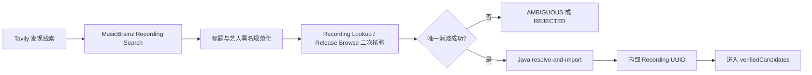

# 候选池 Agent 质量评测与优化

**状态：** 实施中 v1.1  
**最后更新：** 2026-08-20  
**所属功能域：** `04-功能规格/歌曲世界杯/`  
**前置规格：** `02-Agent候选池策展.md`、`03-Agent候选池确认与开赛.md`  
**架构约束：** `03-技术架构/11-双Agent-ReAct运行时落地规格.md`  
**数据约束：** `02-音乐数据/04-音乐实体模型与跨平台匹配.md`

> `02-Agent候选池策展.md` 的文件名属于历史引用。本篇及新增代码统一使用“候选池生成 Agent”，不使用“策展 Agent”或 `curated` 作为新业务术语。质量规则与旧文档冲突时，以本篇为准。

## 1. 背景与目标

候选池工程闭环已经能够完成：用户输入偏好、Agent 返回 32/64 首候选、Java 校验、用户调整并创建赛事。但“返回足够数量的合法 Recording ID”只代表契约正确，不代表推荐质量合格。

本规格建立一套可重复执行的质量评测与优化机制，使候选池生成 Agent 能够证明：

1. 正确理解用户是在限定艺人、以艺人为起点，还是开放探索；
2. 推荐结果随输入意图真实变化，而不是机械返回目录顺序；
3. 在需要时自主调用目录、Milvus、Tavily 与 MusicBrainz，不采用固定工具流水线；
4. 网络发现的歌曲只有完成 MusicBrainz 消歧和 Java 入库后才能进入候选池；
5. 推荐理由具体、可解释，不以模板化描述掩盖低相关结果；
6. 可以通过确定性校验、LLM Judge、真实工具回放与少量人工抽检持续回归。

本篇不增加第三个业务 Agent。评测器、Critic 和 LLM Judge 都是候选池生成 Agent 的工程质量设施，不是面向用户的新 Agent。

## 2. 范围与非目标

### 2.1 本期范围

- 用户意图策略及边界；
- 候选相关性、范围遵循、实体可信度、解释质量和工具效率指标；
- 离线测试集、真实 Provider 测试集和回归基线；
- ReAct 动作与 Observation 的结构化可观测性；
- Tavily 发现、MusicBrainz 消歧、Java 幂等导入的证据链；
- 确定性校验 + LLM Judge + 人工抽检的组合评测；
- 失败样本沉淀、版本对比与发布门禁。

### 2.2 本期不做

- 为所有音乐建立完整知识图谱；
- 依据固定艺人比例强行制造多样性；
- 用用户不可见的“审美分数”替代自然语言意图；
- 允许模型凭参数记忆创造歌曲或 MusicBrainz 身份；
- 将网页摘要直接当作规范歌曲实体；
- 采集歌词、完整音频或其他可能侵权的内容；
- 在生产请求中保存 chain-of-thought、完整 Prompt 或网页全文。

## 3. 最高优先级原则

```text
用户明确范围
  > 用户表达的偏好与探索方向
  > 实体真实性与可验证性
  > 候选相关性
  > 与意图相符的多样性
  > 候补数量
```

- 多样性必须服从用户意图，不设置全局“单一艺人最高占比”。
- 用户明确只玩某位或某组艺人的歌曲世界杯时，不能为了多样性加入其他艺人。
- 用户只把艺人作为兴趣起点时，不能把候选池错误锁定为该艺人的完整目录。
- 任意网络候选未经 MusicBrainz 与 Java 规范化，不得以“数量不足”为理由放宽进入条件。
- 目标仍为赛事规模两倍；可信候选不足时允许短候补，正式位不足时必须明确失败。

## 4. 用户意图策略

### 4.1 三类意图

| `intentMode` | 用户含义 | 候选范围 |
| --- | --- | --- |
| `ARTIST_LOCKED` | 明确要求只使用指定艺人或指定艺人集合 | 最终候选的规范艺人署名必须处于允许集合 |
| `ARTIST_SEEDED` | 以指定艺人为兴趣起点，允许寻找相近方向 | 保留起点关联，同时允许跨艺人扩展 |
| `OPEN_DISCOVERY` | 只描述歌曲、风格、语言、年代、情绪或场景 | Agent 根据偏好自主决定艺人分布 |

`ARTIST_LOCKED` 名称中的单数不限制只能传一个艺人；首版应支持一个或多个明确限定艺人。

### 4.2 判定规则

明确排他表达包括但不限于：

- “只要／仅限／全部都选……”；
- “做一场某某的个人歌曲世界杯”；
- “不要其他歌手”；
- “只比较这几位艺人的作品”。

以下表达默认不是锁定：

- “我喜欢张悬，想找类似的歌”；
- “从安溥开始探索”；
- “张悬加上一些气质相近的中文独立音乐”；
- 只在输入中出现艺人名，但没有排他含义。

意图模糊时默认 `ARTIST_SEEDED`，不得擅自缩窄为 `ARTIST_LOCKED`。若完全没有艺人线索，则使用 `OPEN_DISCOVERY`。

### 4.3 类型化意图输出

Supervisor 在提交候选池前必须在黑板中形成以下结构；它可以在获得新 Observation 后修订，不要求由固定的第一节点一次完成：

```json
{
  "intentMode": "ARTIST_SEEDED",
  "allowedArtistIds": [],
  "seedArtistIds": ["java-artist-uuid"],
  "seedArtistMbids": ["musicbrainz-artist-mbid"],
  "preferenceFacets": {
    "language": ["中文"],
    "mood": ["克制", "温柔"],
    "scene": ["夜晚散步"],
    "genre": ["独立音乐"],
    "era": []
  },
  "confidence": "high",
  "evidenceSpans": ["我喜欢张悬，想找相近的音乐"]
}
```

`evidenceSpans` 只保留用户原文中的短片段，用于审计分类依据；不得记录模型隐藏推理。

### 4.4 艺人身份、别名与合作作品

- 锁定校验基于 Java Artist ID、MusicBrainz Artist MBID 和已审核的别名/身份关系，不做纯字符串包含判断。
- 艺名变化、繁简体、罗马字和常见别名不能仅凭模型判断为同一实体；需要 MusicBrainz alias 或本地已审核关系支持。
- 当目标艺人出现在 MusicBrainz 正式 artist credit 中时，合作或 featuring 作品默认可以进入 `ARTIST_LOCKED`；若用户明确要求“个人独唱／非合作”，则进一步排除。
- 同名艺人无法消歧时不得纳入锁定集合。

## 5. ReAct 质量行为

候选池生成仍采用受控 Supervisor ReAct。安全前置条件和最终校验可以是强制门禁，但可选工具不得形成固定的 `catalog → web → MusicBrainz → rank` 流水线。

### 5.1 黑板最小状态

```json
{
  "intentPolicy": {},
  "preferenceFacets": {},
  "verifiedCandidates": [],
  "discoveryHints": [],
  "entityResolutionResults": [],
  "evidenceRegistry": [],
  "actionHistory": [],
  "observations": [],
  "budgets": {},
  "stagnationCount": 0,
  "terminationReason": null
}
```

### 5.2 动作决策要求

Supervisor 每轮只能从候选池动作白名单选择下一动作，并给出可记录的 `reasonCode`，例如：

```json
{
  "action": "search_web",
  "reasonCode": "verified_candidates_below_target_and_local_scope_exhausted",
  "arguments": {"queryRef": "query-3"}
}
```

允许记录的 `reasonCode` 是离散工程状态，不是思维链。至少包括：

- `intent_policy_missing`；
- `locked_artist_identity_unresolved`；
- `verified_candidates_below_active_size`；
- `verified_candidates_below_target`；
- `local_scope_exhausted`；
- `cross_artist_expansion_allowed`；
- `external_hints_require_resolution`；
- `candidate_pool_requires_rerank`；
- `candidate_pool_ready_for_validation`；
- `budget_or_stagnation_limit_reached`。

### 5.3 动态多样性

多样性不是统一配额，而是意图一致性的一部分：

- `ARTIST_LOCKED`：不评判跨艺人数量，只评判允许艺人集合的精确遵循、作品覆盖和重复版本控制；
- `ARTIST_SEEDED`：评判起点关联是否清楚、外扩是否合理，但不规定起点艺人的最低或最高百分比；
- `OPEN_DISCOVERY`：评判结果是否覆盖输入中的多个有效偏好面向，并惩罚无理由地被单一艺人目录垄断；
- 用户明确指定窄范围、单张专辑、单一时期或单一语言时，相应约束优先于多样性。

Critic 不得仅依据“艺人数越多越好”打分；必须读取 `intentPolicy` 后再判断候选分布。

## 6. 网络发现与 MusicBrainz 强制核验链

### 6.1 信任状态

| 状态 | 含义 | 能否进入候选池 |
| --- | --- | --- |
| `DISCOVERY_HINT` | Tavily 或知识资料中出现的歌名/艺人线索 | 否 |
| `MB_SEARCHED` | 已执行 MusicBrainz Search，但尚未唯一消歧 | 否 |
| `MB_AMBIGUOUS` | 多个候选无法可靠区分 | 否 |
| `MB_VERIFIED` | Recording 与 Artist 身份已通过二次核验 | 否，仍需 Java 导入 |
| `CATALOG_IMPORTED` | Java 已幂等写入并返回内部 Recording UUID | 是 |
| `REJECTED` | 信息冲突、实体不存在或可信度不足 | 否 |

### 6.2 处理链路



### 6.3 消歧要求

MusicBrainz Search 分数只能作为召回信号，不能单独决定入库。`MB_VERIFIED` 至少要求：

1. 规范化歌名一致，或差异可由明确的版本标签解释；
2. Artist Credit 与目标艺人 MBID、已验证 alias 或允许的合作署名一致；
3. 对候选 Recording 执行 Lookup，必要时 Browse Release 核对发行信息；
4. 同名结果存在多个合理候选时，不自动选取第一项；
5. Live、remix、伴奏、翻唱等版本必须保留版本信息，不能与原版静默合并；
6. Java 以 MusicBrainz Recording MBID 幂等导入，并在事务完成后返回内部 UUID。

时长、发行年份和专辑信息可以辅助消歧，但缺失不必然拒绝；关键身份发生冲突时必须拒绝。

### 6.4 失败策略

- `MB_AMBIGUOUS`：Agent 可重新规划更精确的查询；达到预算后淘汰该候选；
- MusicBrainz 429/503/超时：按共享限流、缓存、退避和熔断规则执行；正式位足够时允许短候补降级；
- Java 导入失败：不得使用临时外部 ID 替代；
- 外部扩展全部失败：可使用足够的本地合法候选完成，但必须给出影响范围的结构化警告；
- 正式位不足：返回 `insufficient_candidates`，不得填入未经验证的歌曲。

## 7. 推荐理由质量

每首候选理由应回答“为什么它适合这次输入”，而不是重复“来自已验证目录”。理由允许基于：

- 用户明确表达的艺人、歌曲、场景、情绪、语言、年代或风格；
- 本地受信元数据；
- 已审核 Milvus Claim；
- 已登记的网页证据摘要。

理由不得：

- 编造歌词内容、音乐人关系、发行事实或用户心理；
- 把 MusicBrainz Search 分数描述成审美相似度；
- 引用未登记来源的具体外部事实；
- 暴露 Prompt、工具内部参数或思维过程。

推荐理由理想长度为 20–80 个汉字。仅使用“符合你的偏好”“来自规范目录”等通用模板的项目记为 `GENERIC_REASON`。

## 8. 评测数据集

### 8.1 目录与格式

评测资产放入：

```text
Demos/
└── evals/
    └── candidate-pool/
        ├── cases.jsonl
        ├── fixtures/
        ├── expected-policies.json
        ├── run_eval.py
        └── reports/
```

每个 case 至少包含：

```json
{
  "caseId": "artist-seeded-zhangxuan-01",
  "category": "ARTIST_SEEDED",
  "input": {
    "size": 16,
    "preferenceText": "我喜欢张悬，想找适合夜晚散步的相近音乐",
    "seedArtistIds": ["fixture-artist-id"]
  },
  "expected": {
    "intentMode": "ARTIST_SEEDED",
    "mustIncludeArtistIds": [],
    "allowedArtistIds": [],
    "networkRequired": false,
    "minimumVerifiedCount": 16
  },
  "tags": ["zh-CN", "mood", "artist-expansion"]
}
```

不得在 fixtures 中保存真实 API Key、完整网页正文、歌词或受版权保护的音频。

### 8.2 首版用例组成

首版不少于 24 个 case：

| 类别 | 最少数量 | 重点 |
| --- | ---: | --- |
| `ARTIST_LOCKED` | 6 | 单艺人、多艺人限定、别名、合作曲、排除合作、同名艺人 |
| `ARTIST_SEEDED` | 6 | 相近艺人、场景扩展、年代扩展、模糊表达 |
| `OPEN_DISCOVERY` | 6 | 纯情绪、风格、语言、年代、场景及组合约束 |
| 外部发现与异常 | 6 | 本地不足、MusicBrainz 歧义、超时、无结果、重复版本、网络失败 |

至少一半用例使用中文自然表达；测试文本应像普通用户输入，不写成 Prompt 工程指令。

### 8.3 两种运行模式

1. `fixture`：固定目录、Tavily、MusicBrainz 与模型输出，用于确定性契约回归；
2. `live`：真实 DeepSeek、Tavily、MusicBrainz 和本地 Java 目录，用于评估实际质量与工具行为。

CI 默认运行 `fixture`；`live` 由显式命令触发，设置调用预算并对密钥脱敏。真实结果不得因为 Provider 波动直接修改确定性基线。

## 9. 评测方法

### 9.1 确定性校验

以下指标由程序计算，不交给 LLM 判断：

- `CONTRACT_VALID`：状态、数量、字段与 UUID 契约合法；
- `RECORDING_ID_UNIQUE`：无重复 Recording ID；
- `CATALOG_EXISTENCE_RATE`：最终歌曲均可由 Java 查询；
- `LOCKED_ARTIST_PRECISION`：锁定模式候选的艺人署名全部合法；
- `EXTERNAL_ENTITY_VERIFICATION_RATE`：外部发现入选项均具有 MusicBrainz MBID 和 Java UUID；
- `ACTIVE_POOL_COMPLETION_RATE`：正式位达到 16/32；
- `RESERVE_POOL_COMPLETION_RATE`：候选总量达到 32/64；
- `VERSION_COLLISION_COUNT`：未解释的重复版本数量；
- `GENERIC_REASON_RATE`：通用模板理由比例；
- `TOOL_BUDGET_VIOLATION_COUNT`：超预算动作数量；
- `UNRESOLVED_HINT_LEAK_COUNT`：外部线索未核验却进入结果的数量。

### 9.2 LLM Judge

LLM Judge 通过独立调用读取：用户输入、类型化意图、最终候选的受信元数据、精简理由和结构化证据摘要。不得读取生成 Agent 的隐藏推理。

每项使用 1–5 分并返回简短依据：

| 维度 | 判断内容 |
| --- | --- |
| `intent_understanding` | 是否正确识别锁定、起点或开放探索 |
| `preference_relevance` | 候选整体是否响应艺人、场景、情绪、风格等偏好 |
| `scope_adherence` | 是否遵守明确的包含、排除和锁定范围 |
| `intent_appropriate_variety` | 多样性是否与意图相符，而非单纯艺人数更多 |
| `reason_specificity` | 理由是否具体对应本次输入和歌曲事实 |
| `pool_coherence` | 整组候选是否构成可理解、可游玩的选择空间 |

首版 Judge 默认仍走可替换 Provider Adapter，可使用 DeepSeek；Judge 调用必须使用独立 Prompt、独立上下文和固定 JSON Schema。模型评分不是事实校验，不能覆盖确定性失败。

### 9.3 人工抽检

人工不需要为每首歌打大量分数。每次质量版本只抽检：

- 所有确定性失败 case；
- LLM Judge 最低分和分歧最大的 case；
- 至少 3 个 live case；
- 所有新增网络实体中的随机样本。

人工结论为 `accept`、`needs_revision` 或 `invalid_entity`，并填写一句问题摘要。它用于校正 Judge 和补充回归用例，不替代自动化测试。

## 10. 首版发布门槛

### 10.1 硬门禁

以下任一失败均不得通过：

| 指标 | 门槛 |
| --- | ---: |
| 契约合法率 | 100% |
| Java 目录存在率 | 100% |
| 锁定艺人精确率 | 100% |
| 外部入选实体核验率 | 100% |
| 未核验线索泄漏数 | 0 |
| 未解释重复 Recording ID 数 | 0 |
| 正式位完成率 | 100%，预期不足用例除外 |
| 工具预算违规数 | 0 |

### 10.2 质量门槛

| 指标 | 首版门槛 |
| --- | ---: |
| LLM Judge 总体均分 | ≥ 4.0 / 5 |
| 任一非故障 case 的 `scope_adherence` | ≥ 4 / 5 |
| 推荐理由通用模板比例 | ≤ 20% |
| 目标为完整候补的 fixture case 中，候补完成率 | ≥ 95% |
| 相反偏好输入的 active 候选重合率 | 原则上 ≤ 70% |

“相反偏好输入重合率”只用于同一开放目录下明显不同的输入，不适用于同一艺人锁定、同一专辑限定或目录极小的 case。任何多样性或重合率指标都不得覆盖用户明确范围。

## 11. 可观测性

### 11.1 结构化事件

每轮动作记录：

```json
{
  "requestId": "uuid",
  "runId": "uuid",
  "step": 4,
  "action": "resolve_musicbrainz",
  "reasonCode": "external_hints_require_resolution",
  "status": "succeeded",
  "inputCount": 6,
  "outputCount": 4,
  "rejectedCount": 2,
  "durationMs": 842,
  "budgetRemaining": {"musicbrainz": 2, "web": 0},
  "observationCode": "PARTIAL_ENTITY_RESOLUTION",
  "timestamp": "ISO-8601"
}
```

禁止记录：

- DeepSeek、Tavily 或内部服务密钥；
- chain-of-thought；
- 完整系统 Prompt；
- 未裁剪网页正文；
- Cookie、访客可识别信息或长期画像原文。

### 11.2 终止原因

终态必须包含一个有限枚举：

- `TARGET_REACHED_AND_VALIDATED`；
- `ACTIVE_SIZE_REACHED_SHORT_RESERVE`；
- `INSUFFICIENT_VERIFIED_CANDIDATES`；
- `BUDGET_EXHAUSTED`；
- `STAGNATION_LIMIT_REACHED`；
- `MODEL_UNAVAILABLE`；
- `DEPENDENCY_UNAVAILABLE`；
- `CONTRACT_REJECTED`。

## 12. 质量报告

每次 eval 输出机器可读 JSON 和面试展示友好的 Markdown 摘要，至少包含：

- 代码版本、Prompt/工具契约版本和模型配置标识；
- fixture/live 模式及 case 数量；
- 硬门禁结果；
- 各类意图的指标对比；
- 工具使用、平均迭代数、耗时和失败分布；
- 最差 case、回归 case 和人工抽检结论；
- 与上一基线的改善和退化；
- 不包含密钥、完整 Prompt 或思维链的代表性动作轨迹。

`reports/` 默认不提交包含真实 Provider 原始响应的文件；只提交脱敏聚合结果和明确选取的安全样例。

## 13. 优化循环

```text
运行 fixture + live eval
  → 定位失败维度
  → 归因到意图、工具、实体、排序、理由或预算
  → 修改一个可识别版本的组件
  → 重跑失败集与完整回归
  → 人工抽检低分样本
  → 达到门槛后更新基线
```

每次优化优先修复硬失败，再处理相关性和解释质量。禁止为了提高单项分数加入与用户意图冲突的固定比例、固定艺人列表或固定工具顺序。

## 14. 建议实施顺序

1. 为 Agent 黑板补充 `intentPolicy`、`reasonCode`、`terminationReason` 和实体信任状态；
2. 将网络线索与已验证 Recording 分离为不同类型，阻止未核验数据进入重排；
3. 完成 MusicBrainz 二次核验与 Java 幂等导入结果契约；
4. 建立 24 个 fixture case 和确定性评分器；
5. 接入 LLM Judge JSON Schema 与结果存档；
6. 运行首轮 live 基线，定位通用理由和目录顺序回退问题；
7. 优化 Supervisor 工具描述、查询扩展、重排和 Critic；
8. 达到发布门槛后，将代表性质量报告纳入项目 README 或面试演示材料。

## 15. 完成定义

- [x] 三类意图均有类型化输出、首批回归用例和锁定范围错误边界；
- [x] 不存在全局单艺人占比或跨艺人强制配额；
- [ ] `ARTIST_LOCKED` 对艺人身份、别名、合作与排除条件执行确定性校验；
- [ ] `ARTIST_SEEDED` 和 `OPEN_DISCOVERY` 能产生与输入相关的非机械目录结果；
- [x] 外部歌曲必须通过 MusicBrainz 二次查询和 Java 导入，结果才可进入最终候选；
- [x] 16/32 首赛事分别以 32/64 个规范候选为目标，并正确处理短候补与不足；
- [ ] 推荐理由通用模板比例达到门槛；
- [x] 24 个意图 fixture 可一条命令重复运行，result eval 支持独立输入与脱敏报告；
- [x] 确定性硬门禁与独立 LLM Judge 已有可运行接口；人工抽检流程待接入；
- [x] 运行日志可还原动作、结果、耗时、预算和终止原因，但不暴露思维链；
- [ ] 全部硬门禁通过，质量指标达到首版发布标准。
