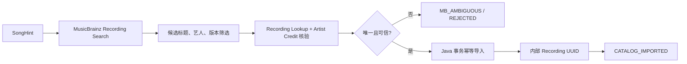

# 候选池 Agent 外部歌曲发现与目录扩容

**状态：** 已实现并验证 v1.0  
**最后更新：** 2026-08-21  
**所属功能域：** `04-功能规格/歌曲世界杯/`  
**前置规格：** `03-Agent候选池确认与开赛.md`、`10-候选池Agent质量评测与优化.md`  
**架构约束：** `03-技术架构/11-双Agent-ReAct运行时落地规格.md`

> 本篇只增强候选池生成 Agent 的工具能力，不新增第三个业务 Agent。赛前仍只有候选池生成 Agent，赛后仍只有报告 Agent。

## 1. 目标

当用户进行 `ARTIST_SEEDED` 或 `OPEN_DISCOVERY` 探索时，Agent 不应因为本地目录恰好有足够歌曲而机械返回单一艺人的目录。它应能在需要时自主执行网络发现、歌曲线索提取、MusicBrainz 实体消歧和 Java 幂等导入，逐步把可信的新歌曲纳入候选范围。

成功标准不是“尽可能多地爬歌”，而是：

1. 用户明确限定艺人时绝不越界；
2. 开放探索的目录过窄时，Agent 能尝试合理扩展；
3. 网络文本永远不能直接成为赛事歌曲；
4. 新歌曲只有获得 MusicBrainz 身份和内部 `recordingId` 后才可入选；
5. 无法核验时透明降级，不编造结果；
6. 成功导入的实体可被后续请求复用。

## 2. 现状与问题

当前已具备以下链路：

```text
用户偏好 → ReAct Supervisor → Tavily → LLM 提取线索
→ Java / MusicBrainz 二次核验 → Java 导入 → 候选池
```

真实请求验证发现：Tavily 能返回网页来源，但常见摘要没有明确的“歌名 + 艺人”对，导致线索提取为空；本地目录又主要由张悬／安溥构成，最终开放探索仍可能全部落在同一艺人范围。

本篇解决的是“外部发现质量不足”，不是给推荐强行设艺人比例。

## 3. 范围与非目标

### 3.1 本期范围

- 候选池 ReAct 对网络工具的自主调用与重试决策；
- 多轮、不同意图的检索查询规划；
- Tavily 来源筛选、内容裁剪和结构化歌曲线索提取；
- 必要时从来源页面提取受限文本片段；
- MusicBrainz Search + Lookup 二次核验；
- Java 按 Recording MBID 幂等导入与本地缓存；
- 可观测的发现、拒绝、导入与降级原因；
- 面向中文独立音乐的真实回归样本。

### 3.2 本期不做

- 爬取、存储或展示完整歌词、完整音频、付费内容；
- 绕过网站访问限制、验证码或登录墙；
- 把网易云、QQ 音乐、酷狗等非公开接口作为生产数据底座；
- 从网页直接推断歌曲事实或把 LLM 记忆当作实体来源；
- 建立新业务 Agent、用户歌单社交或完整知识图谱；
- 对开放探索设置“每位艺人至多占 X%”之类的硬配额。

## 4. 最高优先级规则

```text
用户明确范围
  > 内部与 MusicBrainz 实体可信度
  > 用户偏好相关性
  > 外部发现的覆盖度
  > 候补数量
```

- `ARTIST_LOCKED`：仅可检索和导入允许艺人的作品；网络搜索只能帮助补齐同一范围，不能扩展艺人。
- `ARTIST_SEEDED`：可从起点艺人向外探索；是否扩展、扩展到哪里由 Supervisor 根据当前候选和证据决定。
- `OPEN_DISCOVERY`：当本地规范候选只集中于一个艺人或无法覆盖用户有效偏好面向时，Supervisor 应尝试外部发现；尝试不等于保证一定导入成功。
- 所有新入选歌曲必须是 `CATALOG_IMPORTED`，其他信任状态都不可进入候选池。

## 5. ReAct 工具行为

### 5.1 工具白名单

| 工具/动作 | 责任 | 可产生的状态 |
| --- | --- | --- |
| `search_catalog` | 读取本地受信歌曲目录 | `CATALOG_IMPORTED` |
| `search_knowledge` | 查询已审核的 Milvus Claim | 仅补充证据 |
| `plan_external_queries` | 依据偏好与 Observation 生成少量检索方向 | 查询计划，不产生实体 |
| `search_web` | 通过 Tavily 发现公开网页资料 | `DISCOVERY_SOURCE` |
| `extract_song_hints` | 从受限摘要/片段抽取明确歌曲线索 | `DISCOVERY_HINT` |
| `resolve_musicbrainz` | 调用 Java 完成 Search、Lookup 与导入 | `CATALOG_IMPORTED` / `MB_AMBIGUOUS` / `REJECTED` |
| `rerank_candidates` | 仅从内部规范实体排序并给出理由 | 最终候选 |

`plan_external_queries` 和 `extract_song_hints` 是候选池生成 Agent 内部可调用能力，不是独立用户可见 Agent。

### 5.2 非固定工作流

正常路径不是固定的“目录 → 搜索 → MusicBrainz → 排序”。Supervisor 可按黑板状态决定：

- 本地候选已充足且与锁定范围一致：可直接排序；
- 开放探索的结果过窄：可先规划网络查询；
- 网页线索足够明确：直接进入 MusicBrainz 核验；
- 网页线索不明确：可换一条查询或使用受限页面片段补充；
- 重试无收益、预算不足或实体歧义：停止扩展，使用已验证歌曲并给出警告。

强制门禁只包括：不得越过锁定范围、不得直接使用网页线索、不得超预算、不得把未核验实体交给前端。

### 5.3 查询计划结构

每次网络扩展最多生成 1–3 条不同目的的查询，避免相同关键词重复检索：

```json
{
  "queries": [
    {
      "purpose": "find_curated_song_lists",
      "query": "克制 温柔 中文独立音乐 夜晚散步 推荐 歌曲",
      "expectedEvidence": "含具体歌名和艺人名的公开推荐列表"
    },
    {
      "purpose": "find_adjacent_artists",
      "query": "张悬 安溥 相似 华语独立音乐 推荐",
      "expectedEvidence": "相近艺人与代表作线索"
    }
  ]
}
```

查询文本不记录为用户画像；生产日志只记录 `purpose`、结果数、是否产生可解析线索及哈希化查询标识。

## 6. Tavily 发现与线索提取

### 6.1 来源与内容边界

- 首选公开可访问的乐评、音乐媒体、唱片公司、艺人官方页、公开歌单介绍和可信编辑推荐页。
- 搜索结果只保留 URL、标题、发布日期、短摘要和最多一个受限正文片段。
- 不保存整页 HTML、Cookie、登录态、歌词全文、音频地址或用户身份信息。
- 访问受限、需要登录、内容与音乐无关或疑似盗版聚合页时直接丢弃。

### 6.2 `SongHint` 契约

```json
{
  "title": "歌曲名",
  "artistName": "艺人名",
  "sourceUrl": "https://...",
  "sourceTitle": "来源标题",
  "evidenceSnippet": "不超过 200 字、明确同时出现歌名与艺人名的片段",
  "queryPurpose": "find_curated_song_lists"
}
```

线索必须满足：

1. 片段中可观察到歌名和艺人名，不能由模型补齐；
2. 一条线索只表示待核验候选，不能进入重排；
3. 同一 `title + artistName + sourceUrl` 只保留一次；
4. `ARTIST_LOCKED` 下线索艺人必须先通过允许范围的名称/MBID映射，否则丢弃；
5. 单轮最多 12 条线索，单次 MusicBrainz 导入最多处理 6 条，防止请求放大。

### 6.3 无线索处理

若 Tavily 返回来源但 `SongHint` 为零：

- Supervisor 得到 `WEB_SOURCES_WITHOUT_EXTRACTABLE_SONGS` Observation；
- 可以在预算内规划一条不同目的的查询；
- 不重复完全相同的查询；
- 再次无线索则停止外部发现，记录 `EXTERNAL_DISCOVERY_NO_VERIFIED_MATCHES`；
- 最终结果可使用本地合法候选，但前端需显示非阻塞说明。

## 7. MusicBrainz 核验与 Java 入库

### 7.1 强制链路



### 7.2 Java 责任

Java 是唯一能把外部实体变成业务歌曲的边界：

- 使用 MusicBrainz Recording MBID 做幂等键；
- 保存受信的歌名、艺人、专辑/发行信息、版本标记、MusicBrainz MBID、来源类型和导入时间；
- 已存在实体时直接返回原内部 `recordingId`；
- 对 429/503 实施限速和退避；
- 导入失败时不返回临时外部 ID；
- 返回每条线索的状态、拒绝代码和可安全展示的简短原因。

首版不把 Tavily 的网页 URL 当作音乐元数据事实；它只作为发现证据。封面仍遵循已有 Cover Art Archive / 本地封面规则。

### 7.3 消歧与版本规则

- 不能仅凭 MusicBrainz Search 首条结果或分数导入；
- 至少验证规范化标题、Artist Credit 和 Recording Lookup 返回的 MBID；
- Live、Remix、Demo、伴奏、翻唱与原版必须保留版本信息；
- 有多个合理结果且无法判定时标记 `MB_AMBIGUOUS`；
- 同名艺人、别名、合作署名遵循 `10-候选池Agent质量评测与优化.md` 的身份规则；
- 用户要求“个人独唱/非合作”时，合作署名不可自动通过。

## 8. 预算、重试与终止

| 资源 | 单次候选池上限 | 说明 |
| --- | ---: | --- |
| 外部查询计划 | 2 轮 | 每轮 1–3 条不同目的查询 |
| Tavily 查询 | 4 次 | 包含无结果或无可提取线索的调用 |
| 页面片段补充 | 2 次 | 仅公开可访问页面，受总时限约束 |
| SongHint | 12 条 | 去重后总量 |
| MusicBrainz 导入批次 | 2 次 | 每批最多 6 条 |
| Agent 总工具调用 | 10 次 | 沿用运行时预算 |
| 总时限 | 120 秒 | 到期优先返回已验证结果 |

终止原因复用既有枚举：

- `TARGET_REACHED_AND_VALIDATED`；
- `ACTIVE_SIZE_REACHED_SHORT_RESERVE`；
- `INSUFFICIENT_VERIFIED_CANDIDATES`；
- `BUDGET_EXHAUSTED`；
- `STAGNATION_LIMIT_REACHED`；
- `DEPENDENCY_UNAVAILABLE`。

## 9. 前端反馈

候选确认页不展示思维链和工具明细，只展示对用户有帮助的结果：

| 情况 | 提示 |
| --- | --- |
| 外部歌曲成功导入 | “已补充经过核验的外部发现歌曲” |
| 搜索到网页但无明确歌曲线索 | “已尝试扩展相近方向，但没有找到可核验的新歌曲；本次结果主要来自现有目录。” |
| MusicBrainz 暂不可用 | “外部歌曲核验暂不可用，本次候选范围可能较少。” |
| 正式位不足 | 进入候选不足状态，不允许开赛 |

候选卡片可在不增加噪音的前提下以小标签标明“已补充核验歌曲”；不展示原始网页文本或 MusicBrainz 分数。

## 10. 可观测性与安全

每轮仅记录结构化摘要：

```json
{
  "action": "extract_song_hints",
  "reasonCode": "external_sources_need_entity_candidates",
  "queryPurpose": "find_curated_song_lists",
  "sourceCount": 3,
  "hintCount": 4,
  "resolvedCount": 2,
  "rejectedCount": 2,
  "durationMs": 680,
  "budgetRemaining": {"toolCalls": 4}
}
```

禁止记录 API Key、完整 Prompt、完整网页正文、cookie、chain-of-thought 或可识别用户的长期画像原文。

## 11. 验收与回归

### 11.1 确定性测试

- `ARTIST_LOCKED` 网络扩展不会出现允许集合外艺人；
- `ARTIST_SEEDED` 可在需要时外扩，不被起点艺人锁死；
- `OPEN_DISCOVERY` 的单艺人本地目录会至少触发一次外部扩展尝试；
- `DISCOVERY_HINT`、`MB_AMBIGUOUS` 和 `REJECTED` 不能进入结果；
- 导入的外部歌曲均同时具有 MusicBrainz MBID 与内部 UUID；
- 重复 SongHint 与重复 MBID 不产生重复 Recording；
- 工具预算、时间预算和停止条件有效。

### 11.2 真实回归样本

至少覆盖：

1. “克制、温柔、有叙事感的中文独立音乐，适合夜晚散步”；
2. “从张悬开始，找气质接近但不重复的中文独立音乐”；
3. “只玩张悬的歌曲世界杯，不要其他歌手”；
4. 本地目录不足、网页来源明确列出歌曲的方向；
5. 网页无可提取歌曲、MusicBrainz 歧义和 Provider 超时。

每次真实回归报告候选数量、艺人分布、外部发现数、MusicBrainz 成功/拒绝数、终止原因与用户可见警告；不保存密钥和原始网页正文。

## 12. 实施顺序

1. 扩展 Agent 黑板：查询计划、来源、线索、解析结果、查询去重和预算；
2. 将 Tavily 工具改为支持不同查询目的及受限内容片段；
3. 新增结构化 `SongHint` 提取与无效线索拒绝逻辑；
4. 补齐 Java 批量核验结果的拒绝码、版本和导入审计字段；
5. 加入前端简洁警告与“已补充核验歌曲”来源标签；
6. 增加 fixture、真实回归脚本和质量门禁；
7. 用真实中文独立音乐输入验收并记录基线。

## 13. 已确认的实现决策

1. 当 Tavily 摘要不足时，允许 Agent 读取公开页面的受限文本片段：最多 2 次、每页最多约 2,000 字；不得访问登录墙、验证码或其他受限站点。
2. 通过 MusicBrainz 核验并由 Java 成功导入的外部歌曲，默认持久化至公共本地目录；以 MusicBrainz Recording MBID 幂等去重，供后续请求复用。
3. 候选确认页对这类歌曲显示低调的“已补充核验歌曲”标签；不展示复杂工具细节、MusicBrainz 分数或原始网页内容。
4. 外部扩展未找到可核验新歌、但本地候选足够开赛时，保留非阻塞说明，明确本次结果主要来自现有目录。

## 14. 实现验证记录

- 真实 `OPEN_DISCOVERY` 请求成功返回 32 首候选，其中 2 首为 `EXTERNAL_VERIFIED`，并由 MusicBrainz 核验、Java 导入后获得内部 `recordingId`；候选覆盖 5 位艺人。
- 真实 `ARTIST_LOCKED` 请求保持候选艺人完全在张悬／安溥范围内；后续实现已增加“锁定范围内候选充足时不进行无意义网络扩展”的门禁。
- Agent、Java、前端的自动化测试、Docker Agent 测试镜像与完整 Compose 构建均通过。
