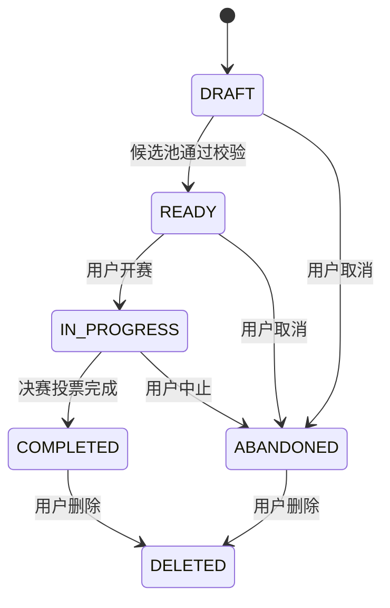

# Java 业务服务规格

**状态：** 草案 v0.1  
**最后更新：** 2026-08-01  
**上级规格：** `00-系统总体设计与规格路线图.md`  
**依赖规格：** `03-MVP产品规格：歌曲世界杯与音乐探索.md`、`04-音乐实体模型与跨平台匹配.md`、`05-Agent工作流规格.md`

## 1. 服务职责

Java 业务服务是系统的业务事实源，负责账号/访客身份、音乐实体查询入口、赛事生命周期、赛程、投票、历史、偏好报告版本和与 Agent 服务的受控协作。

它不负责 LLM 推理、网页资料研究、Milvus 语义检索或直接访问模型供应商。

## 2. 技术基线

| 项目 | 选型 |
| --- | --- |
| 运行时 | Java 21 |
| 框架 | Spring Boot 3 |
| 持久化 | MySQL 8 |
| 缓存/短状态 | Redis |
| ORM | MyBatis-Plus 或 JPA，具体实现阶段确定 |
| 鉴权 | Spring Security；访客身份 + 后续账户登录 |
| 服务调用 | HTTP + JSON；向前端转发 SSE |
| API 风格 | REST 为主，统一错误响应 |

## 3. 领域边界与所有权

| 领域数据 | 写入者 | 读取者 |
| --- | --- | --- |
| 用户/访客身份 | Java | Java、Agent（受控只读） |
| 音乐规范实体与 Provider Mapping | Java 的实体服务 | Java、Agent（受控只读） |
| 赛事、候选池、对局、投票 | Java | Java、Agent（仅已授权只读） |
| 本场洞察、整体报告版本 | Java 保存；Agent 建议内容 | Java、Agent（只读上下文） |
| 知识 Claim 与向量数据 | 知识库管道 | Agent；Java 仅管理引用展示 |
| 模型/网页研究中间状态 | Python Agent | Java 仅接收最终结构化结果 |

**硬规则：** Agent 服务没有 MySQL 写权限；所有影响赛事状态和用户数据的操作只能通过 Java 领域服务完成。

## 4. 核心领域模型

### 4.1 身份

```text
User
  └── GuestSession（可选，未登录用户的临时身份）
```

- 未登录用户首次访问时，Java 创建随机访客标识并通过安全 Cookie 关联；
- 访客可创建和完成赛事，但数据仅保证当前浏览器会话可见；
- 登录后可保存跨设备历史和整体偏好报告；
- 访客数据迁移到账户的规则由账户规格补充，MVP 不要求第三方登录。

### 4.2 赛事聚合

```text
Tournament
  ├── TournamentEntry [16 或 32]
  ├── Match [单败淘汰对局]
  │     └── Vote [每个已完成对局恰一条]
  ├── TournamentInsight [可选、版本化]
  └── TournamentSnapshot [展示/审计所需的实体快照]
```

#### Tournament

| 字段 | 含义 |
| --- | --- |
| `id` | 内部 UUID |
| `owner_id` / `guest_session_id` | 私有赛事归属，二者至少有一项 |
| `artist_id` | 规范目标艺人 |
| `mode` | `CLASSIC` / `EXPLORATION` |
| `size` | 仅 `16` / `32` |
| `candidate_source` | `POPULAR` / `RANDOM` / `CUSTOM` / `AGENT_CURATED` |
| `status` | 见 5.1 |
| `bracket_seed` | 可复现随机对阵种子 |
| `winner_entry_id` | 冠军；完成前为空 |
| `version` | 乐观锁版本 |
| `created_at` / `started_at` / `completed_at` | 生命周期时间 |

#### TournamentEntry

每一条 Entry 指向唯一 `music_recording.id`，同时保存创建时的展示快照：歌曲名、艺人显示名、专辑名、封面资源引用、版本标签、外链状态。

快照仅用于历史展示；规范实体仍是关联和推荐的唯一依据。Provider 数据后续刷新不得改变已开始赛事的 Entry 身份。

#### Match 与 Vote

| 字段 | Match | Vote |
| --- | --- | --- |
| 位置 | `round_number`、`match_index` | — |
| 参赛者 | `left_entry_id`、`right_entry_id` | `selected_entry_id` |
| 结果 | `winner_entry_id`、`status` | `reason_code`（可空） |
| 归属 | `tournament_id` | `match_id`、`voter_owner_id` |
| 并发控制 | `version`、`PENDING/COMPLETED` | `(match_id)` 唯一 |

## 5. 状态机与赛事规则

### 5.1 赛事状态



- `DRAFT`：可修改候选池；探索模式等待 Agent 草稿时也属于此状态；
- `READY`：候选池已确认、对阵已生成，但尚未投票；
- `IN_PROGRESS`：至少有一个有效 Vote；
- `COMPLETED`：最终对局完成，冠军确定；
- `ABANDONED`：用户主动中止；不参与整体偏好聚合；
- `DELETED`：对用户不可见，关联派生报告必须失效。

### 5.2 候选池校验

开赛前 Java 必须校验：

1. `size` 只能为 16 或 32；
2. Entry 数量与 `size` 相同；
3. 每个 `recording_id` 唯一；
4. 每个 Recording 对目标艺人的关系符合模式限制；
5. 不含被实体服务标记为近重复/版本冲突的默认排除项，除非来自用户明确自选并二次确认；
6. 当前用户拥有该赛事草稿；
7. 探索模式的 Agent 返回候选仍需重新校验，不能信任 Agent 原始结果。

### 5.3 单败淘汰赛生成

- 16 首赛事预生成 15 场 Match；32 首赛事预生成 31 场 Match；
- 使用 `bracket_seed` 对确认后的候选 Entry 打乱后进入第一轮；
- 下一轮 Match 可在创建时预生成，参赛者在上游对局完成后写入；
- 同一首歌曲不允许在同一赛事中重复出现；
- 不支持平票。用户必须选择一方；若无法选择，可以离开并稍后继续；
- 每个 Match 只允许一次成功投票，不能修改或撤销；
- 决赛完成后在同一事务内写入冠军、完成状态和完成时间。

### 5.4 投票事务

`POST /matches/{matchId}/vote` 必须满足：

1. 校验调用者拥有赛事；
2. 校验赛事为 `READY` 或 `IN_PROGRESS`，Match 为 `PENDING`；
3. 校验选中的 Entry 属于该 Match；
4. 通过数据库行锁或乐观锁防止双击/并发重复投票；
5. 创建唯一 Vote，更新 Match 胜者与状态；
6. 将胜者写入下一轮对应槽位；
7. 首次投票将赛事更新为 `IN_PROGRESS`；
8. 若为最终 Match，同一事务内更新赛事为 `COMPLETED`；
9. 使用 `Idempotency-Key` 支持网络重试，重复请求返回第一次成功结果。

## 6. 业务 API（MVP）

所有 API 前缀为 `/api/v1`；请求/响应使用 JSON。具体字段可在实现阶段扩展，但不得破坏以下语义。

### 6.1 音乐检索

| 方法 | 路径 | 说明 |
| --- | --- | --- |
| `GET` | `/artists/search?q=` | 搜索规范艺人候选 |
| `GET` | `/artists/{artistId}` | 获取艺人摘要与可用赛事能力 |
| `GET` | `/artists/{artistId}/recordings` | 获取可选择 Recording；支持分页与版本过滤 |
| `GET` | `/recordings/{recordingId}` | 获取歌曲详情、封面、试听/外链可用性 |

### 6.2 经典世界杯

| 方法 | 路径 | 说明 |
| --- | --- | --- |
| `POST` | `/tournaments` | 创建经典模式 `DRAFT` |
| `PUT` | `/tournaments/{id}/entries` | 开赛前替换候选池 |
| `POST` | `/tournaments/{id}/prepare` | 校验候选、生成赛程，进入 `READY` |
| `POST` | `/tournaments/{id}/start` | 可选显式开赛；首票也可隐式开始 |
| `GET` | `/tournaments/{id}` | 获取赛事、对局、Entry 快照和当前进度 |
| `POST` | `/matches/{matchId}/vote` | 对局投票 |
| `POST` | `/tournaments/{id}/abandon` | 中止未完成赛事 |

### 6.3 探索世界杯与 Agent 协作

| 方法 | 路径 | 说明 |
| --- | --- | --- |
| `POST` | `/exploration-tournaments/drafts` | 创建探索请求，向 Agent 请求候选草稿 |
| `GET` | `/agent-requests/{requestId}/events` | SSE 获取用户可见阶段事件 |
| `GET` | `/exploration-tournaments/drafts/{id}` | 获取 Agent 返回的候选草稿、说明、警告 |
| `POST` | `/exploration-tournaments/drafts/{id}/confirm` | 用户确认/调整 Entry 后创建赛事并进入 `READY` |
| `POST` | `/tournaments/{id}/insights` | 对完成赛事请求赛后洞察 |
| `GET` | `/tournaments/{id}/insights/latest` | 获取最新已验证洞察版本 |

### 6.4 历史与偏好报告

| 方法 | 路径 | 说明 |
| --- | --- | --- |
| `GET` | `/me/tournaments` | 获取本人/当前访客赛事历史 |
| `DELETE` | `/tournaments/{id}` | 删除私有赛事及其派生数据 |
| `GET` | `/me/taste-profile/status` | 获取赛事数、有效投票数和报告门槛状态 |
| `POST` | `/me/taste-profile/generate` | 达标后请求 Agent 生成报告 |
| `GET` | `/me/taste-profile` | 获取最新未过期报告 |
| `DELETE` | `/me/taste-profile` | 删除报告并标记派生缓存失效 |

### 6.5 统一错误格式

```json
{
  "code": "TOURNAMENT_ENTRY_COUNT_INVALID",
  "message": "赛事需要 16 或 32 首不同的歌曲。",
  "requestId": "uuid",
  "details": {"expected": 16, "actual": 15}
}
```

错误信息不得包含外部 Provider 密钥、堆栈、模型原始输出或其他用户数据。

## 7. 与 Agent 服务的协作

### 7.1 调用方式

- Java 使用内部 HTTP 客户端调用 Python FastAPI；
- 每次调用携带 `request_id`、认证服务凭证、调用者身份范围和输入版本；
- 长耗时 Agent 调用由 Java 创建 `agent_request` 记录，并通过 SSE 向前端转发允许展示的阶段事件；
- Java 校验 Agent 的最终 JSON Schema、实体 ID、候选数量与权限后才保存草稿/洞察；
- Java 对相同幂等键、相同输入版本的请求复用进行中的 Agent Request。

### 7.2 只读上下文接口

Python Agent 读取赛事或偏好时，必须调用 Java 的内部只读接口：

```text
GET /internal/v1/tournaments/{id}/snapshot
GET /internal/v1/users/{id}/taste-signals
GET /internal/v1/music/artists/{id}/recordings
GET /internal/v1/music/recordings/context
```

内部接口仅允许服务身份访问，且 Java 必须再次检查 `user_id` 与赛事归属关系。Agent 不应通过传入的用户 ID 任意读取历史数据。

### 7.3 Agent 结果保存

| 结果 | Java 校验后动作 |
| --- | --- |
| 探索候选草稿 | 保存为可过期 `ExplorationDraft`，等待用户确认 |
| 本场洞察 | 保存版本化 `TournamentInsight`，关联赛事快照版本 |
| 整体报告 | 保存版本化 `TasteProfileReport`，记录所覆盖赛事集合和聚合版本 |
| Agent 失败/超时 | 更新 `agent_request` 状态，不改变赛事和投票 |

## 8. 数据一致性、缓存与删除

### 8.1 一致性

- 赛事、Match、Vote、冠军写入必须在 MySQL 事务内完成；
- Redis 只做缓存、限流、访客会话和 SSE 短状态，不能成为投票事实源；
- 赛事快照一旦 `READY` 不可变；
- 洞察/报告必须绑定输入赛事快照版本；赛事被删除或状态变化后报告标记 `STALE`；
- Agent 建议结果可重试，但不可覆盖用户已确认的候选池。

### 8.2 删除

- 删除赛事时，删除或失效与该赛事关联的 Vote、Insight、Agent Draft 和偏好聚合缓存；
- 删除后赛事不再出现在用户历史、Agent 上下文或整体报告中；
- 若删除导致整体报告门槛不满足，报告状态更新为 `INSUFFICIENT_EVIDENCE`；
- 具体物理删除、备份和审计保留期限由部署与隐私策略确定，但用户侧必须立即不可见且不再参与推荐。

## 9. 安全与权限

1. 所有用户可见赛事 API 都校验赛事归属；赛事默认私有。
2. 访客标识使用不可预测的随机值并设置安全 Cookie 属性；不得将访客 ID 放入可枚举 URL。
3. 账户登录后的密码/令牌细节由认证模块定义；业务接口统一使用 Spring Security Principal。
4. 内部 Java–Python 请求使用单独服务凭证，不复用用户浏览器令牌。
5. 对创建赛事、投票、生成 Agent 报告实施 Redis 限流；防止刷接口和模型成本失控。
6. 前端只能获得外部媒体的合规展示 URL，不能获得服务器下载/签名代理能力。

## 10. 可观测性

每次核心操作记录结构化日志和指标：

```text
request_id, user_or_guest_hash, tournament_id, match_id,
operation, status_before, status_after, latency_ms,
idempotency_key_hash, agent_request_id, error_code
```

关键指标：

- 赛事创建成功率、开赛率、完成率、中止率；
- 投票幂等命中率和并发冲突率；
- 赛事恢复成功率；
- Agent 草稿确认率、Agent 洞察成功率与平均耗时；
- 偏好报告门槛达成率；
- 外部试听可用率与降级率。

## 11. 验收标准

### 11.1 赛事

- [ ] 仅能创建 16 或 32 首赛事；
- [ ] 16/32 首赛事分别生成 15/31 场单败淘汰对局；
- [ ] 同一 `recording_id` 无法重复加入赛事；
- [ ] 候选池确认后，Provider 刷新不改变赛事 Entry 快照；
- [ ] 并发提交同一对局投票时，只有一次写入成功；
- [ ] 网络重试携带相同 `Idempotency-Key` 时不产生第二次 Vote；
- [ ] 决赛投票后冠军、赛事状态和完成时间原子一致；
- [ ] 刷新页面或重新登录后可恢复进行中赛事。

### 11.2 Agent 协作

- [ ] Agent 无法通过任何接口写入赛事、Vote 或 Provider Mapping；
- [ ] Java 拒绝数量不为 16/32、含重复 Recording 或未授权实体的 Agent 草稿；
- [ ] Agent 失败不会改变已有赛事状态；
- [ ] 相同输入的重复请求不会并发创建多个 Agent 草稿；
- [ ] 洞察和报告均保存输入版本与结果版本，可追溯。

### 11.3 隐私

- [ ] 用户不能读取其他用户或其他访客的赛事与报告；
- [ ] 删除赛事后其投票不参与偏好聚合；
- [ ] 访客赛事不会被公开检索；
- [ ] 日志中不记录敏感 Cookie、密码、模型密钥或完整外部受限内容。

## 12. 不在本规格范围内

- 实体表、Provider Mapping 与匹配算法的具体实现；
- Agent 内部 LangGraph 节点和 Milvus Collection Schema；
- 前端页面、动画、晋级图渲染和播放器组件；
- Docker Compose、数据库迁移工具和 CI/CD；
- 完整账户注册、找回密码、第三方 OAuth 的细节；
- 社交、排行榜、多人对战及公开分享。
