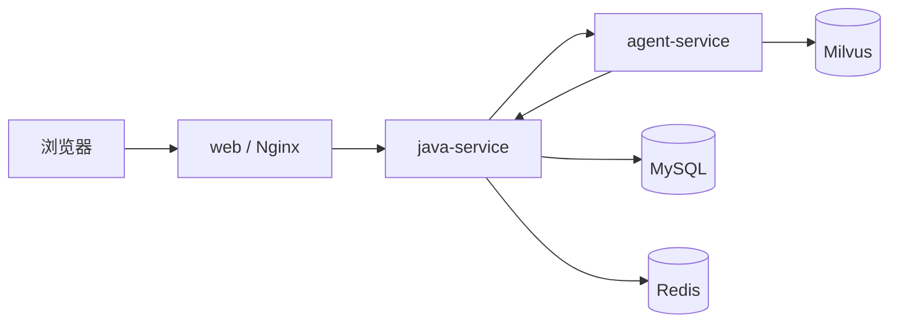

# 本地开发与部署规格

**状态：** 草案 v0.1  
**最后更新：** 2026-08-01  
**上级规格：** `00-系统总体设计与规格路线图.md`  
**关联规格：** `06-Java业务服务规格.md`、`07-Python Agent服务规格.md`、`08-Web前端规格.md`、`09-Milvus知识库与事实治理规格.md`

## 1. 目标

让开发者在取得必要模型 Key 后，通过一条 Docker Compose 命令启动完整本地环境；确保服务依赖、环境变量、健康检查、数据库迁移和测试入口可复现。

MVP 的部署目标是本地演示与求职作品展示，不预设特定云厂商。

## 2. 仓库布局

```text
music-agent/
├── web/                         # React + TypeScript
├── java-service/                # Spring Boot
├── agent-service/               # FastAPI + LangGraph
├── infra/
│   ├── compose.yaml
│   ├── compose.observability.yaml
│   ├── mysql/init/
│   ├── nginx/
│   └── milvus/
├── Specs/
├── Demos/
├── .env.example
├── Makefile                      # 可选：统一开发命令
└── README.md
```

## 3. Docker Compose 服务

### 3.1 默认服务

| 服务 | 容器职责 | 对外暴露 |
| --- | --- | --- |
| `web` | 构建并提供 React 静态资源 | `http://localhost:5173`（开发）或 Nginx 统一入口 |
| `java-service` | REST API、赛事、投票、身份、SSE 转发 | `http://localhost:8080`（开发） |
| `agent-service` | 内部 Agent 工作流 | 仅 Compose 内部网络 |
| `mysql` | 业务与知识权威数据 | `3306` 仅开发 profile 暴露 |
| `redis` | 缓存、限流、访客/SSE 短状态 | 默认不对宿主暴露 |
| `etcd` | Milvus 依赖 | 不对宿主暴露 |
| `minio` | Milvus 依赖对象存储 | 不对宿主暴露 |
| `milvus` | 知识 Claim 向量检索 | `19530` 仅开发 profile 暴露 |

### 3.2 可选 Profile

| Profile | 服务 | 用途 |
| --- | --- | --- |
| `observability` | Langfuse、OTel Collector 及其依赖 | 本地追踪与模型成本观察 |
| `tools` | Adminer/数据库管理工具等 | 仅开发调试，不进入默认启动 |
| `seed` | 演示用实体/Claim 导入任务 | 显式执行，不自动抓取外部内容 |

首版不引入 Kafka/RabbitMQ、Neo4j 或完整生产级任务队列。

## 4. 网络与入口



- 浏览器只能访问 Web 和 Java 的公开 API；
- `agent-service`、MySQL、Redis、Milvus 默认只加入内部 Compose 网络；
- Java 到 Agent 使用 `AGENT_INTERNAL_SERVICE_TOKEN`；
- Java 公开 API 使用 HttpOnly Cookie，浏览器不持有 Agent Token；
- 开发环境的数据库端口暴露必须显式使用 profile，不能成为生产默认配置。

## 5. 环境变量

根目录 `.env.example` 必须包含变量说明，不包含真实密钥。

```text
# 基础
COMPOSE_PROJECT_NAME=music-agent
APP_ENV=local

# MySQL
MYSQL_DATABASE=music_agent
MYSQL_USER=music_agent
MYSQL_PASSWORD=change-me
MYSQL_ROOT_PASSWORD=change-me-root

# Java / Redis
JAVA_PUBLIC_BASE_URL=http://localhost:8080
REDIS_URL=redis://redis:6379/0

# Agent 内部通信
AGENT_INTERNAL_BASE_URL=http://agent-service:8000
AGENT_INTERNAL_SERVICE_TOKEN=change-me-with-a-long-random-value
JAVA_INTERNAL_BASE_URL=http://java-service:8080

# LLM（本地可留空；调用 Agent 时需要）
LLM_PROVIDER=deepseek
LLM_MODEL=deepseek-chat
DEEPSEEK_API_KEY=

# Milvus / Embedding
MILVUS_URI=http://milvus:19530
EMBEDDING_PROVIDER=local_or_remote
EMBEDDING_MODEL=BAAI/bge-m3

# 可选网络查询与可观测性
WEB_RESEARCH_PROVIDER=
WEB_RESEARCH_API_KEY=
LANGFUSE_PUBLIC_KEY=
LANGFUSE_SECRET_KEY=
```

规则：

- `.env` 必须在 `.gitignore` 中；
- 生产/演示密钥通过运行环境注入，不写入 Compose 文件、镜像、日志或 README；
- `AGENT_INTERNAL_SERVICE_TOKEN` 不得使用示例默认值启动非本地环境；
- 未设置 `DEEPSEEK_API_KEY` 时，经典世界杯与基础业务仍可启动，探索赛事/洞察返回明确的模型不可用状态。

## 6. 启动与停止

### 6.1 初次启动

```bash
cp .env.example .env
# 填写 DEEPSEEK_API_KEY；其他默认开发变量按需修改
docker compose -f infra/compose.yaml up --build
```

预期顺序：

1. MySQL、Redis、etcd、MinIO 与 Milvus 健康；
2. Java 执行数据库迁移并通过 `/actuator/health`；
3. Agent `/health/ready` 成功访问 Java 内部接口和必要配置；
4. Web 启动并可通过 Java 访问 API。

### 6.2 常用命令

```bash
docker compose -f infra/compose.yaml up --build
docker compose -f infra/compose.yaml down
docker compose -f infra/compose.yaml --profile observability up -d
docker compose -f infra/compose.yaml logs -f agent-service
docker compose -f infra/compose.yaml exec java-service ./mvnw test
docker compose -f infra/compose.yaml exec agent-service pytest
```

可选 Makefile 仅封装上述命令，不能隐藏破坏性操作。

## 7. 数据库、迁移与演示数据

### 7.1 MySQL

- Java 使用 Flyway 管理 schema 迁移；
- 迁移脚本随 Java 服务版本提交，禁止手工修改容器内 schema；
- 本地数据通过命名 Volume 保留，`down -v` 明确表示删除本地演示数据；
- 启动时不自动导入大规模音乐数据、不自动调用外部 API。

### 7.2 Milvus

- Knowledge Collection 通过受控初始化任务创建；
- `seed` profile 仅导入少量、可公开、可审计的演示 Claim；
- 向量索引数据使用独立 Volume；
- 修改嵌入模型版本时需走重建任务，不能原地混写。

## 8. 健康检查与依赖顺序

| 服务 | 存活检查 | 就绪检查 |
| --- | --- | --- |
| MySQL | 容器运行 | `mysqladmin ping` + 可连接数据库 |
| Redis | 容器运行 | `redis-cli ping` |
| Milvus | 容器运行 | Milvus health endpoint/SDK 检查 |
| Java | Spring Actuator liveness | 数据库、Redis、迁移可用 |
| Agent | `/health/live` | Java 内部接口、模型配置状态、Milvus 可选依赖状态 |
| Web | 静态服务存活 | 可获取首页资源 |

`depends_on` 必须使用健康检查条件，不能仅依赖容器启动顺序。Agent 的 Milvus 依赖可降级；Milvus 不就绪不应阻止经典世界杯启动。

## 9. CI 基线

使用 GitHub Actions 或等价 CI，在每次 Pull Request 执行：

1. 前端 lint、类型检查、Vitest；
2. Java 格式检查、单元测试、集成测试；
3. Python ruff/format、mypy（可选）、pytest；
4. API/Pydantic 契约测试；
5. Docker 镜像构建；
6. 密钥扫描与依赖漏洞扫描；
7. Mock 模型/Milvus 环境下的 Agent 离线评估。

主分支可额外执行 Compose smoke test：启动所有默认服务，调用健康检查，跑最小经典赛事和 Mock Agent 工作流。

CI 不使用真实 DeepSeek Key、不执行真实网页抓取、不调用需要计费的音乐 Provider。

## 10. 配置分层

| 环境 | 用途 | 特征 |
| --- | --- | --- |
| `local` | 个人开发 | Docker Compose、可暴露调试端口、示例数据 |
| `test` | CI/集成测试 | Mock 模型与 Provider、临时 Volume、无真实密钥 |
| `demo` | 求职展示 | 受控真实模型 Key、最小演示数据、关闭调试端口 |
| `prod` | 未来部署 | 外部密钥管理、受限网络、备份与监控 |

应用配置必须使用环境变量覆盖，不能通过修改源码切换环境。

## 11. 安全与备份原则

- 容器以非 root 用户运行（数据库官方容器除外）；
- 镜像使用固定版本或受控 digest，定期更新；
- 内部网络服务不映射公共端口；
- 演示环境使用强随机 MySQL 密码和服务 Token；
- MySQL 业务数据与 Milvus 索引分别备份；恢复后需校验 Claim 与索引版本一致；
- 删除用户赛事后，备份保留策略另行定义，但在线系统必须立即停止使用已删除数据。

## 12. 验收标准

- [ ] 新开发者可根据 README 和 `.env.example` 完成本地启动；
- [ ] `docker compose up --build` 可启动默认完整系统；
- [ ] 未配置真实模型 Key 时，非 Agent 功能仍可用且错误明确；
- [ ] 浏览器无法直连 Agent、MySQL、Redis 或 Milvus；
- [ ] Java、Agent 和数据库健康检查正确反映依赖状态；
- [ ] 数据库 schema 完全由 Flyway 从空库创建；
- [ ] 演示数据导入不依赖未经授权的外部抓取；
- [ ] CI 不使用真实密钥或外网付费调用；
- [ ] 停止/清理命令明确区分保留与删除 Volume 的行为；
- [ ] Compose smoke test 可完成最小经典赛事与 Mock Agent 工作流。

## 13. 不在本规格范围内

- 云厂商、域名、CDN、HTTPS 证书和生产 Kubernetes 选型；
- 生产数据库高可用、跨地域备份和灾备演练；
- 商业音乐 Provider 的合同、SDK 或付费账户配置；
- 完整 Git 分支策略与发布审批流程；
- Neo4j、Kafka/RabbitMQ 等后续增强组件。
